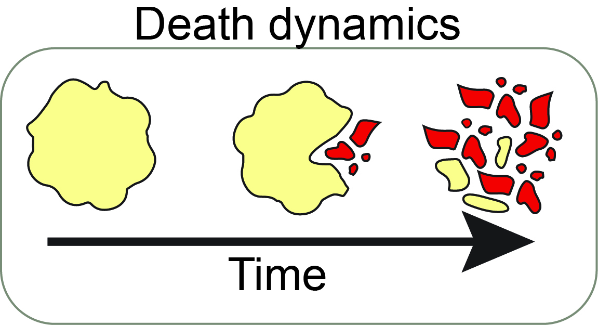
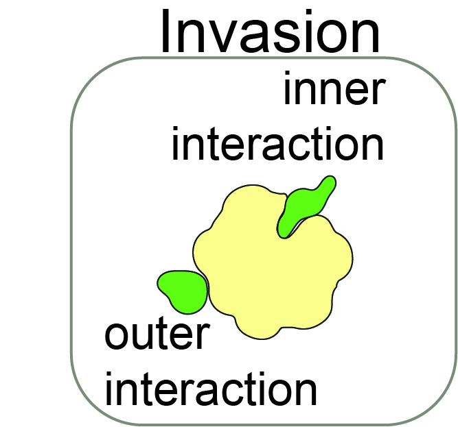
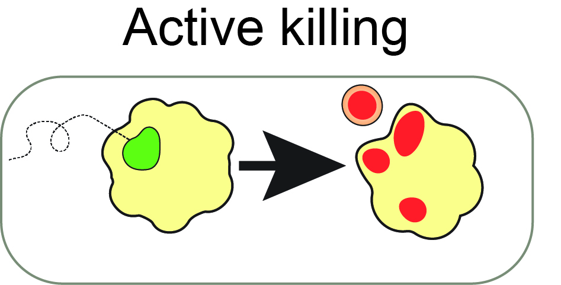
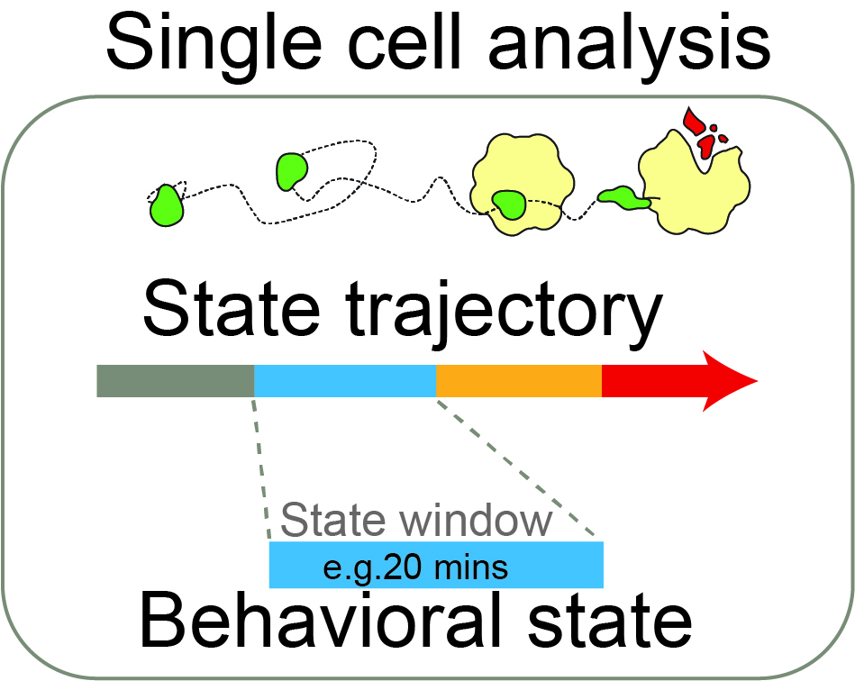

# BEHAV3D Explorer

BEHAV3D Explorer is a tool for analyzing how cells behave in 3D microscopy images: no coding required, built for biologists.

It works with pretty much any 3D microscopy data, for example 3D live co-cultures or intravital microscopy, and turns your raw movies into quantitative, cell-by-cell readouts. Here's the kind of analysis you can get out of it:

<p align="center">
  
  
  
  
</p>

There's no one-size-fits-all solution, so BEHAV3D-Explorer is built as a set of flexible, modular tools: you pick and combine the segmentation, tracking and analysis methods that fit your experiment, or your computational power, instead of being locked into one fixed pipeline. Navigating a complex software with so many options is difficult, but you don't have to figure it out alone: **a built-in Co-pilot assistant** (QueenB) sits next to the panel, explains what each parameter does, and can fill in the forms for you.

📖 [Full wiki](https://imaigene-dream3d.github.io/BEHAV3D/)


## Installation (3 steps, no code)

1. Download this repository: green **Code > Download ZIP** button, then unzip it.
2. Open the `installation` folder and double-click the installer for your system:
   - **Windows:** `install_behav3d_windows.bat`
   - **macOS:** `install_behav3d_macOS.command`
3. Follow the on-screen prompts. The installer handles everything (conda, GPU, PyTorch, Cellpose) automatically.

> Using Linux, or prefer the terminal? See the manual installation and advanced options below.

## How to open the program

Double-click the launcher for your system, inside the `napari` folder:

- **Windows:** `napari/run_behav3d_windows.bat`
- **macOS:** `napari/run_behav3d_macOS.command`
- **Linux:** `napari/run_behav3d_linux.sh`

The BEHAV3D plugin opens automatically inside napari, covering the full pipeline: data preparation → segmentation → tracking → feature extraction → filtering.

## Files you need before starting

**Required:**
- Per sample, a microscopy image (.czi, .lif .tiff, .zarr).
- A [metadata.csv file](./configs/metadata.csv) listing the samples to analyze. You can build this directly inside BEHAV3D-Explorer with the built-in metadata editor, no need to prepare it beforehand. If you prefer editing it outside the app, on Windows we recommend https://www.moderncsv.com/, as it doesn't alter the format on save.

**Optional:**
- Already segmented data per sample.
- Already tracked data per sample.

See the exact `metadata.csv` structure [below](#metadatacsv-structure).

## Co-pilot assistant

No setup needed: the Co-pilot dock on the right of the napari panel is ready to use as soon as you open BEHAV3D. Ask it about any parameter or method, and confirm with one click to let it fill in the form for you.

Developers extending the assistant should start with the
[assistant architecture and change guide](chatbot/README.md).

---

## FAQ

<details>
<summary><strong>The installer doesn't work / PyTorch errors out</strong></summary>

Try one of these two options from the terminal, inside the `behav3d` environment:

**Option 1:** Install `nomkl` **before** installing PyTorch (avoids conflicts with OpenMP)
```bash
mamba install -c conda-forge igraph "blas=*=openblas"
mamba install nomkl
```

**Option 2:** Reinstall Cellpose with conda instead of pip
```bash
pip uninstall cellpose -y
mamba install -c conda-forge cellpose
```
</details>

<details>
<summary><strong>I want to use Jupyter Notebook instead of the graphical panel</strong></summary>

Built for advanced users who want more control over each step of the pipeline.

1. Install [VS Code](https://code.visualstudio.com/Download) with the Python and Jupyter extensions.
2. Open the BEHAV3D folder.
3. Open `notebooks/run_behav3d.ipynb`.
4. Select the kernel: Python Environments > behav3d.

Or from a web browser:
```bash
mamba activate behav3d
jupyter notebook notebooks/run_behav3d.ipynb
```
</details>

---

## Technical documentation (advanced)

<details>
<summary><strong>Manual installation (Linux, or if you prefer the terminal)</strong></summary>

### Linux
```bash
cd path/to/BEHAV3D/installation
chmod +x install_behav3d_linux.sh
./install_behav3d.sh
```

### macOS via terminal
```bash
cd path/to/BEHAV3D/installation
chmod +x install_behav3d_linux.sh
./install_behav3d.sh
```

The installer automatically:
- Installs Miniforge (conda) if not found
- Detects your GPU (NVIDIA CUDA / Apple Silicon MPS / CPU-only)
- Creates the conda environment with all dependencies
- Installs PyTorch with the appropriate backend
- Installs Cellpose for cell segmentation

### Fully manual installation

**Step 1: Install Miniforge**

If you don't have conda/mamba installed, download [Miniforge](https://github.com/conda-forge/miniforge/releases/latest/) (recommended, includes `mamba`) or [Miniconda](https://docs.conda.io/projects/conda/en/latest/user-guide/install/index.html).

> We recommend `mamba` over `conda` for faster dependency resolution. Miniforge includes it by default. All `mamba` commands below work the same with `conda` if you're using Miniconda/Anaconda.

**Step 2: Create the environment**

```bash
cd /path/to/BEHAV3D

# Create environment from the yml file
mamba env create -f environment.yml
mamba activate behav3d

# Install Cellpose and ConvPaint
pip install cellpose>=3.0 napari-convpaint

# Install PyTorch (choose ONE option based on your system):

# First remove any preexisting pytorch installations:
mamba remove pytorch torchvision torchaudio

# CPU only (all platforms):
mamba install pytorch=2.4.1 torchvision=0.19.1 torchaudio=2.4.1 -c pytorch

# CUDA 12.1 (Windows/Linux with NVIDIA GPU):
mamba install pytorch=2.4.1 torchvision=0.19.1 torchaudio=2.4.1 pytorch-cuda=12.1 -c pytorch -c nvidia

# Install the BEHAV3D package
pip install -e .

# Register the Jupyter kernel
python -m ipykernel install --user --name=behav3d --display-name "behav3d"
```

### Installer options

```bash
# Check system info before installing
python install_behav3d.py --check

# Force CPU-only installation (even if a GPU is detected)
python install_behav3d.py --cpu-only

# Only install PyTorch/Cellpose (if the environment already exists)
python install_behav3d.py --pytorch-only
```

### Manual napari launch

```bash
mamba activate behav3d
napari
```
Then open the BEHAV3D plugin from the **Plugins** menu.

> The launcher reads its environment configuration from `napari/.config/behav3d_env.json`, generated by the installer.
</details>

<a id="metadatacsv-structure"></a>
<details>
<summary><strong>metadata.csv structure</strong></summary>

### Required
| Column Name                    | Explanation                                                                                         |
|-------------------------------|-----------------------------------------------------------------------------------------------------|
| sample_name                   | Name to assign to the sample; used for naming output files/folders.                                |
| organoid_line                 | Name of the multicellular structure line used in the experiment (e.g. `lineA`, `lineB` — a patient-derived organoid line, a spheroid line, etc.). Analysis visual results will be split on organoid lines                                     |
| tcell_line                    | Name or type of immune population used (e.g. `lineA` — a CAR-T product, an engineered T-cell line, a donor identifier). Analysis visual results will be split on tcell lines                                 |
| exp_nr                        | Experiment number for tracking and reproducibility.                                                |
| well                          | Well identifier on the experimental plate (e.g. `well01`).                                          |
| tcell_channel                 | Index of the fluorescence channel representing T cells in the raw image. (Channel indexing starts at 0)                                      |
| live_channel                  | Index of the fluorescence channel representing alive cells in the raw image. (Channel indexing starts at 0)             |
| dead_channel                  | Index of the fluorescence channel representing dead signal in the raw image. (Channel indexing starts at 0)                                  |
| contact_threshold             | Distance threshold (in `distance_unit`) to define T cell-organoid or T cell - T cell contact.                        |
| pixel_distance_xy             | Physical pixel spacing in the XY plane (usually in micrometers per pixel).                         |
| pixel_distance_z              | Physical spacing between Z slices (z-step), in same unit as `pixel_distance_xy`.                   |
| distance_unit                 | Unit for all provided spatial distances (e.g. `μm` for micrometers).                                        |
| time_interval                 | Time between consecutive frames (usually in seconds).                                              |
| time_unit                     | Unit of the time interval (e.g. `s` for seconds, 'm' for minutes, 'h' for hours).                                                  |
| raw_image_path                | Full path to the original CZI or raw imaging file.                                                 |

### Optional
| Column Name                    | Explanation                                                                                         |
|-------------------------------|-----------------------------------------------------------------------------------------------------|
| tcell_segments_image_path     | Path to the segmented T cell image (e.g. .zarr file).                                              |
| tcell_tracks_image_path       | Path to the image showing T cell tracks over time.                                                 |
| tcell_tracks_csv_path         | Path to the CSV file containing T cell tracking data.                                              |
| organoid_segments_image_path  | Path to the segmented organoid image (e.g. .zarr file).                                            |
| organoid_tracks_image_path    | Path to the image showing organoid tracks over time.                                               |
| organoid_tracks_csv_path      | Path to the CSV file containing organoid tracking data.                                            |

</details>

<details>
<summary><strong>Segmentation with Cellpose</strong></summary>

To use **Cellpose** for 3D segmentation with pretrained models using the `run_behav3d.ipynb` notebook:

### Pretrained Models
You can find and download pretrained T cell and Organoid Cellpose models in [Zenodo](https://zenodo.org/records/18872978) or in the `behav3d/preprocessing/segmentation/models` folder.


### Prerequisites

1.  **Metadata**: Ensure your `metadata.csv` is correctly populated with `sample_name`, `raw_image_path`, and cell type categories (Organoid, Immune, Other).
2.  **Image Format**: Input images should be converted to **Zarr** format (using the "Convert to Zarr" button in the notebook) for efficient multiprocessing.


### Workflow in `run_behav3d.ipynb`

#### 1. Configure Channel Labels
Before running segmentation, you must map your image channels to cell type labels.
-   Locate the **Configure Channel Labels** section.
-   Select **"Same labels for all samples"** or **"Per-sample configuration"**.
-   Assign the correct label (e.g., `tcell`, `organoid`, `dead`) to each channel index.
-   Click **"Save Channel Configuration"**.

#### 2. Run Cellpose Segmentation
There are separate panels for different cell categories:

##### **Organoid Segmentation**
-   **Pretrained Model**: Specify the path of your pretrained Cellpose model file and load it.
-   **Input Channels**: Select which channels (e.g., `organoid1`) to segment.
-   Click **"Apply"**.

##### **Immune and Other Cell Segmentation**
-   **Pretrained Model**: Specify the path of your pretrained Cellpose model file and load it.
-   **Input Channels**: Select which channel (e.g., `tcell1`) to segment.
-   Click **"Apply"**.


### Visualization and Verification

After segmentation, use the **Visualize the sample** button:
1.  Select the sample from the dropdown.
2.  Click **"Visualize the sample"**.
3.  This launches **Napari**: overlay segmented and original raw channels for easy inspection.


---

*Note: To train a new Cellpose model, refer to the `train_behav3d_cellpose.ipynb` notebook.*

</details>

<details>
<summary><strong>Tracking with btrack</strong></summary>

## btrack Tracking

[btrack](https://github.com/quantumjot/btrack) is a Bayesian multi-object tracking library designed for cell tracking in time-lapse imaging. It uses a motion model and object features to build consistent cell trajectories across timepoints, handling cell divisions, disappearances, and re-appearances robustly.

BEHAV3D uses btrack to link segmented cell instances across frames into full tracks, producing per-cell trajectory data used in downstream behavioral analysis.

### Provided Default Configurations

Pre-configured btrack motion model config files (`.json`) for common cell types are included in the `behav3d/preprocessing/tracking/models/` folder:

| Config file | Suitable for |
|---|---|
| `cell_config.json` | Generic cell tracking (moderate speed, large objects) |
| `particle_config.json` | Fast, small objects (e.g. T cells, immune cells) |

These configs define the motion model parameters (e.g., max search radius, noise covariance) and are passed directly to the btrack `BayesianTracker`.

### Workflow in `run_behav3d.ipynb`

#### 1. Select a Tracking Configuration
- In the **Tracking** section of the notebook, select the config file appropriate for your cell type.
- You can point to a custom `.json` config if the defaults don't match your acquisition settings.

#### 2. Configure Tracking Parameters

| Parameter | Description |
|---|---|
| **Volume** | Physical XYZ bounding box of your acquisition in micrometers |
| **Max search radius** | Maximum distance (µm) a cell can travel between frames |
| **Step size** | Number of frames to look ahead/behind when linking |

#### 3. Run Tracking
- Click **"Run Tracking"** to link segmented objects into tracks.
- Output tracks are saved as `.csv` and `.zarr` files per sample in `images/{sample_name}/`.

#### 4. Visualize Tracks
- Use the **"Visualize the sample"** button to open Napari with the tracked data overlaid on the raw image.

### Output Files

| File | Contents |
|---|---|
| `{sample_name}_{cell_type}_tracks.csv` | Per-cell track data (position, time, track ID) |
| `{sample_name}_{cell_type}_tracks.zarr` | Tracked labels as a 4D array (T, Z, Y, X) |

These files are automatically picked up by the downstream **Analysis** module to compute behavioral metrics (speed, contact duration, killing events, etc.).

---

*Note: For custom motion models, refer to the [btrack documentation](https://btrack.readthedocs.io).*

</details>

<details>
<summary><strong>Chatbot deployment (maintainers only)</strong></summary>

## Deploying / Managing the Chatbot

The co-pilot runs as a **CPU-only [Modal](https://modal.com) service** that proxies requests to the DeepSeek API. The DeepSeek key stays server-side; the endpoint is public. This section is only relevant if you are managing the hosted service.

### Prerequisites

- A [Modal](https://modal.com) account with the CLI installed (`pip install modal`)
- A [DeepSeek API](https://platform.deepseek.com) key
- Authenticated: `python -m modal token new`

### 1. Store the DeepSeek API key as a Modal secret

```bash
python -m modal secret create deepseek-api-key DEEPSEEK_API_KEY=<your-key>
```

> Set a **monthly spend limit** in the DeepSeek dashboard to cap costs.

### 2. Build the RAG index

The RAG index embeds all BEHAV3D documentation and parameter descriptions so the bot can retrieve relevant context for every question.

```bash
python -m modal run chatbot/app.py::ingest
```

Re-run this whenever files in `chatbot/knowledge/` or `chatbot/schema_cards.json` change.

### 3. Deploy

```bash
python -m modal deploy chatbot/app.py
```

The deploy output will print the endpoint URL. Update `napari/assistant_config.json` if it changes:

```json
{ "endpoint": "https://<your-modal-url>.modal.run", "timeout": 60 }
```

The service runs on CPU with `min_containers=1` (always warm, ~$6/month at default specs). No GPU or model weights are downloaded, so cold start only takes a few seconds.

### 4. Development / hot-reload

```bash
python -m modal serve chatbot/app.py
```

This starts a temporary endpoint that hot-reloads on file changes. Useful for testing prompt changes without a full deploy.

### Changing the model

The service defaults to `deepseek-v4-flash`. To switch models, set the `DEEPSEEK_MODEL` environment variable before deploying:

```bash
DEEPSEEK_MODEL=deepseek-v4-pro python -m modal deploy chatbot/app.py
```

Available options: `deepseek-v4-flash` (fast, cheap), `deepseek-v4-pro` (stronger, pricier).

### Monitoring costs

- DeepSeek usage: [platform.deepseek.com](https://platform.deepseek.com) → Usage
- Modal compute: [modal.com/apps](https://modal.com/apps), under the `behav3d-assistant` app
- Set a DeepSeek spend limit to prevent runaway costs from unexpected traffic

</details>

<details>
<summary><strong>Developer options</strong></summary>

## Developer Options

### Developer Mode

BEHAV3D supports a lightweight developer mode that can be activated without modifying any code.

**How to enable:**

Create an empty file named `.behav3d_dev` in the BEHAV3D project root directory (the same folder that contains `README.md`):

```bash
# Linux / macOS
touch .behav3d_dev

# Windows PowerShell
New-Item -ItemType File .behav3d_dev
```

**What it does:**

| Effect | Detail |
|---|---|
| Window title | Adds `[DEV MODE]` to the napari window title bar |
| Environment variable | Sets `BEHAV3D_DEV_MODE=1` for the duration of the session |
| Console output | Enables extra verbose logging in some pipeline stages |

**How to disable:**

Delete or rename the `.behav3d_dev` file:

```bash
# Linux / macOS / Windows
del .behav3d_dev        # Windows CMD
Remove-Item .behav3d_dev  # Windows PowerShell
```

**For developers, checking dev mode in code:**

```python
import os
if os.environ.get("BEHAV3D_DEV_MODE") == "1":
    print("Running in developer mode")
```

> **Note:** The `.behav3d_dev` file is listed in `.gitignore` and will never be committed to version control. It is a purely local, per-machine toggle.

</details>

---

## About AI Usage

*The BEHAV3D Explorer toolkit was developed with the assistance of AI models from OpenAI (Codex, ChatGPT), Anthropic (Sonnet, Haiku, Opus), Cursor and Google (Gemini Flash, Gemini Pro).*
*All AI model code edits have been supervised by our team of developers and have been tested thoroughly among the team of developers and by outside testers.*
