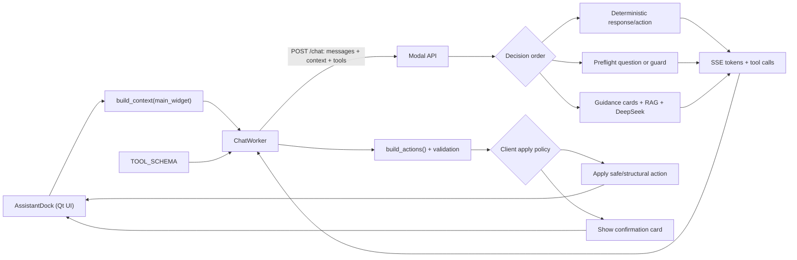

# BEHAV3D Assistant developer guide

The BEHAV3D Assistant is a napari chat UI backed by a CPU-only Modal service.
It combines:

- the current state of the open BEHAV3D interface;
- deterministic calculations and workflow guards;
- curated guidance and retrieved project documentation;
- DeepSeek streaming and native tool calling;
- client-side validation and controlled UI updates.

The DeepSeek key remains in a Modal secret. The current endpoint is public and
does not require a bearer token. If the endpoint is missing or unreachable, the
napari client falls back to a limited local responder that can explain parameter
cards but cannot use the LLM.

## Design principles

1. **Live state is authoritative.** The assistant should not ask for values that
   are already visible in the application.
2. **The model cannot edit arbitrary state.** It can only propose tools defined
   by the client, and `set_ui_value` can only target the current live control
   registry.
3. **Deterministic logic handles deterministic questions.** Calculations,
   validation gates, and high-risk workflow decisions should not depend on model
   interpretation when the required inputs are structured.
4. **The UI owns validation and confirmation.** Model tool calls are proposals.
   The napari client validates them, detects no-ops, and decides whether to apply
   them directly or show a confirmation card.
5. **Knowledge is scoped and provenance-aware.** A setting from another module,
   method, or historical experiment is not evidence for the current workflow.
6. **One user turn produces one request.** Applying an action does not trigger a
   hidden model continuation. The next turn starts from freshly serialized UI
   state.

## Architecture



### Request lifecycle

1. `AssistantDock` records the user turn and keeps at most 12 user/assistant
   exchanges. Long-lived facts come from structured live context, not old chat
   text.
2. `build_context(main_widget)` snapshots the active tab, metadata, unsaved
   Metadata Builder draft, validation state, visible controls, active method and
   cell type, queue, logs, result files, analysis state, and optional experiment
   references.
3. `ChatWorker` sends `messages`, `context`, and `TOOL_SCHEMA` to `POST /chat`
   on a background Qt thread.
4. The service filters out tools the current interface cannot perform.
5. The service tries deterministic action handlers first, then deterministic
   preflight questions. The first matching handler returns immediately.
6. If no handler matches, the service combines deterministic guidance cards
   with the top RAG results, builds the system prompt, and streams a DeepSeek
   response.
7. The client receives visible text and tool calls over SSE. Visible text is
   translated to researcher-facing labels before display.
8. `build_actions()` validates tool arguments against the current schema and
   live controls. The model never receives a direct Qt object reference.
9. `AssistantDock` applies structural or permitted blank-field actions, or
   renders a confirmation card for existing and sensitive values. Metadata
   values proposed by the LLM always use the confirmation path.
10. On the next user turn, context is rebuilt from the actual interface. No-op
    actions are acknowledged without being repeated.

The guided Metadata Builder wizard is a deliberate exception to the network
path: while it is active, `_assistant.py` handles short answers locally and
updates its deterministic question queue. A free-form send cancels that wizard
and returns to the normal request lifecycle.

### Wire protocol

The client sends:

```json
{
  "messages": [{"role": "user", "content": "Explain btrack search radius"}],
  "context": {"current_step": "tracking"},
  "tools": [{"name": "set_ui_value", "parameters": {}}]
}
```

`POST /chat` returns an SSE stream containing newline-delimited JSON events:

```text
{"type":"status","stage":"retrieval","component":"retrieval","message":"...","request_id":"..."}
{"type":"status","stage":"provider","component":"deepseek","message":"...","request_id":"..."}
{"type":"token","text":"..."}
{"type":"tool_calls","calls":[{"name":"set_ui_value","arguments":{...}}]}
{"type":"done"}
```

Failures use `{"type":"error","message":"..."}` followed by `done`.
All events include a short `request_id` and elapsed server time. `GET /health`
is a cheap Modal and RAG check that reports the active model, chunk count,
control contract version, and knowledge version. `GET
/health?probe_provider=true` also sends a one-token request to DeepSeek and
returns its status and latency. Use the provider probe interactively or during
diagnosis, not as a high-frequency monitor.

## Component map

| File | Responsibility | Change it when |
|---|---|---|
| `behav3d/napari/_assistant.py` | Chat UI, quick buttons, local metadata wizard, history, streaming, action cards, no-op handling, and apply/confirm policy. | Changing the chat experience or how validated actions are presented/applied. |
| `behav3d/napari/_assistant_client.py` | Endpoint configuration, background HTTP/SSE and health workers, classified failures, automatic retry, and offline fallback. | Changing transport, timeouts, health checks, authentication, or degraded behavior. |
| `behav3d/napari/_assistant_context.py` | Defensive serialization of live BEHAV3D state and experiment references. | The assistant needs to read a new piece of UI, metadata, log, result, or experiment state. |
| `behav3d/napari/_assistant_controls.py` | Live editable-control registry, getters, setters, units, choices, visibility, and persistence callbacks. | The assistant should be able to inspect or edit a real UI control. |
| `behav3d/napari/_assistant_actions.py` | Tool schemas, tool-call validation, `ProposedAction`, and action application. | Adding a new action or changing how an action is validated/applied. |
| `behav3d/napari/_assistant_schema.py` | Static parameter cards generated from the BEHAV3D configuration. | Changing parameter descriptions or regenerating `schema_cards.json`. |
| `behav3d/napari/_assistant_recommendations.py` | Pure metadata-based EDT calculations and formatting. | Adding a deterministic scientific recommendation. |
| `behav3d/analysis/track_counts.py` | Track-count calculations and QC table generation. | Changing track filtering/count semantics. |
| `chatbot/app.py` | Modal/FastAPI service, deterministic handlers, preflight guards, system prompt, DeepSeek call, tool-call assembly, and SSE output. | Changing server decision logic or the model contract. |
| `chatbot/guidance.py` | Curated, module-scoped guidance cards and deterministic card selection. | Adding stable scientific or workflow guidance. |
| `chatbot/ingest.py` | Collects and chunks Markdown, parameter cards, and selected Python docstrings. | Changing what enters the RAG index. |
| `chatbot/embeddings.py` | BGE embedding wrapper and small NumPy cosine index. | Changing the embedding model or retrieval implementation. |
| `chatbot/smoke_test.py` | End-to-end scenarios against a deployed `/chat` endpoint. | Reproducing feedback or protecting API behavior. |
| `test/test_assistant.py` | Pure-logic regression tests; runs without Modal, Qt interaction, or a network call. | Any assistant behavior changes. |
| `test/fixtures/assistant_feedback_transcripts.json` | Transcript-derived regression cases. | A user reports a conversational failure that should remain fixed. |
| `docs/source/assistant/reference_experiment_profiles.md` | Provenance-labelled examples from previous experiments. | Adding a historical precedent, never a universal default. |

## Contracts and sources of truth

### Live control contract

`control_bindings(main_widget)` is the only supported bridge between model
actions and editable Qt controls. Each binding has a stable ID and public
metadata such as:

```json
{
  "id": "tracking.tcell.btrack.maximum_search_radius",
  "label": "tcell: btrack maximum search radius",
  "value": 12.0,
  "unit": "um",
  "choices": null,
  "visible": true,
  "enabled": true,
  "step": "tracking",
  "method": "btrack",
  "cell_type": "tcell"
}
```

The private binding also carries its Qt getter, setter, and optional persistence
callback. `control_registry()` strips those private objects before sending the
record to the API.

Do not expose an internal configuration key as a control unless a corresponding
widget exists. Visibility, method, strategy, and cell-type scope are part of the
contract, not cosmetic metadata.

`CONTROL_CONTRACT_VERSION` is defined in both
`behav3d/napari/_assistant_controls.py` and `chatbot/app.py`. Bump both values
when IDs or semantics change incompatibly.

### Static parameter schema

`schema_cards.json` is a generated snapshot of the BEHAV3D configuration. It is
used for parameter descriptions, validation of legacy `set_parameter` actions,
offline responses, and RAG. It is not proof that a field exists in the current
UI. Live controls take precedence.

Refresh it after changing the underlying configuration:

```bash
conda run -n behav3d python -c \
  "from behav3d.napari._assistant_schema import dump_cards_json; dump_cards_json('chatbot/schema_cards.json')"
```

### Metadata and experiment references

The Metadata Builder draft is authoritative while it is open, even before it is
saved to a CSV. The context explicitly reports whether records came from loaded
metadata, a loaded copy, or the current draft.

For experiment interpretation, use this precedence:

1. live metadata and current controls;
2. experiment README notes for study intent and operational definitions;
3. saved YAML configuration for intended settings;
4. discovered result files for evidence that a step actually ran.

A saved configuration is not execution evidence. Historical reference profiles
are examples only and must never generate an edit action by themselves.

### Guidance and RAG

Guidance has two complementary sources:

- `GUIDANCE_CARDS` in `chatbot/guidance.py` provides reviewed, module-scoped
  behavior that should be selected consistently.
- The RAG index provides supporting project documentation and parameter
  descriptions. It contains root/wiki Markdown, all `docs/source/**/*.md`,
  `schema_cards.json`, and selected implementation docstrings.

The service combines relevant guidance cards with the top six vector results.
Do not rely on retrieval alone for a safety rule, exact calculation, or behavior
that must be deterministic.

`KNOWLEDGE_VERSION` in `chatbot/guidance.py` is returned by `/health`. Bump it
when deployed guidance or knowledge behavior changes so developers can verify
which service version they are testing.

## Server decision order

The order in `POST /chat` is intentional:

1. **Deterministic actions** return calculated text and optional tool calls.
   Examples include metadata conversions, analysis navigation, EDT/minimum-size
   calculations, tracking radius, and Active Killing settings.
2. **Preflight guards** return one focused question or a scoped explanation when
   required evidence is missing. Examples include unknown channel mapping,
   segmentation signal quality, tracking motion, and missing log evidence.
3. **Model path** retrieves guidance, builds the prompt, calls DeepSeek, and
   streams text plus native tool calls.

Within the deterministic and preflight chains, the first non-`None` handler
wins. Place a new handler carefully and add a regression test for interactions
with neighboring handlers. A preflight handler must require explicit task intent,
not just a topic word: mentioning an organoid line in an analysis question, for
example, is not a metadata-building request. Put broad informational answers
before setup clarifications when both could match.

Keep deterministic response templates experiment-neutral. They may repeat names
found in live metadata or an explicitly matched experiment reference, but must not
embed line, strain, or population names copied from a previous feedback example.

Use a deterministic handler when the answer or action can be derived from
structured context. Use a guidance card for stable explanatory knowledge. Use
RAG for supporting detail. The model path should handle language and ambiguous
research questions, not arithmetic or capability discovery.

## How to make common changes

### Expose a new editable UI control

1. Add a binding in the appropriate builder in
   `_assistant_controls.py`.
2. Give it a stable researcher-independent ID, label, current value, unit,
   choices, step, method/strategy, cell type, and persistence callback.
3. Confirm that `build_context()` exposes it only when it is instantiated and
   correctly scoped.
4. Use the generic `set_ui_value` path unless the edit requires multiple widgets
   or additional side effects.
5. Add tests for registry serialization, valid application, invalid values,
   visibility, and same-value no-op behavior.
6. Bump the control contract version if existing clients or deployed services
   would interpret the ID differently.

### Add a compound action

Use a compound action when one researcher command must calculate data, update
several widgets, create a file, or invoke an existing application workflow.

1. Add the public tool definition to `TOOL_SCHEMA` in
   `_assistant_actions.py`.
2. Add the name to `_TOOL_NAMES` in `chatbot/app.py`.
3. Filter the tool in `tools_for_context()` if it is not always available.
4. Add server-side deterministic selection or prompt rules as appropriate.
5. Parse it into a `ProposedAction` in `build_actions()`.
6. Implement it in `apply_action()` using existing UI methods where possible.
7. Decide explicitly whether `_should_auto_apply()` may apply it or must render a
   confirmation card.
8. Add pure-logic tests and a deployed API smoke scenario.

### Add or correct scientific guidance

- Put stable explanatory guidance in the matching card in
  `chatbot/guidance.py`.
- Put exact calculations in a pure helper and call them from a deterministic
  server action. Inputs should come from live metadata or an explicit user
  measurement.
- Update `docs/source` when the information should also be discoverable through
  RAG and project documentation.
- State units, assumptions, method scope, and whether a value is a starting
  point.
- Never describe an undocumented control merely because a related method has
  one.
- Bump `KNOWLEDGE_VERSION`, rebuild the index when indexed sources changed, and
  rerun API scenarios.

### Add an experiment reference

Add reviewed, provenance-labelled examples to
`docs/source/assistant/reference_experiment_profiles.md`. If local experiment
README or YAML formats need new parsing, update
`_experiment_reference_context()` and `_compact_experiment_config()`.

Keep paths, large feature arrays, and irrelevant defaults out of model context.
The assistant may compare a historical profile with the current experiment, but
must ask for current measurements before proposing an edit.

### Change the chat UI or quick buttons

Edit `_assistant.py`. Quick buttons should send researcher-facing prompts and an
explicit intent; they should not expose hidden technical instructions as if the
user typed them. Preserve the single-request rule and ensure a new free-form
question cancels stale guided state.

### Reproduce new feedback

1. Reduce the transcript to the smallest context and message sequence that
   reproduces the issue.
2. Add a pure regression test or transcript fixture.
3. Add a smoke scenario when model/tool behavior must be checked against the
   deployed API.
4. Fix the lowest appropriate layer: context, control contract, deterministic
   handler, guidance, action validation, or UI.
5. Test nearby modules so a fix for one method does not leak into another.

## Safety checklist

Before merging an assistant change, verify:

- The answer uses live values before asking the researcher to repeat them.
- Every proposed control ID exists, is visible, enabled, and scoped to the active
  module, method, strategy, and cell type.
- Missing biological or acquisition evidence produces one focused question,
  not a plausible guess.
- Exact values come from live data, explicit user input, or a labelled
  deterministic calculation.
- Historical values are named examples and do not trigger actions.
- The model does not claim a configured step ran without a corresponding result.
- Visible text uses UI labels rather than variable, control, or tool names.
- Same-value and already-open actions do not loop.
- Sensitive/existing values follow the intended confirmation policy.
- One user input produces at most one server request.

## Local configuration

The client reads `napari/assistant_config.json`, which is gitignored. Start from
`napari/assistant_config.example.json`:

```json
{
  "endpoint": "https://<your-app>.modal.run",
  "timeout": 60
}
```

`BEHAV3D_ASSISTANT_ENDPOINT` overrides the file. The timeout is split into a
10-second connection timeout and the configured read timeout.

## Runtime status and recovery

The chat dock keeps a persistent service-status row above the transcript. It
shows the current stage and elapsed time instead of a generic loading state:

| UI status | What has been confirmed |
|---|---|
| `Connecting to Modal` | The client is opening the HTTP connection; Modal has not replied yet. |
| `Checking BEHAV3D guidance` | Modal is online and the server is retrieving local documentation. |
| `Waiting for response` | The service is ready, but the response has not started returning yet. |
| `Receiving response` | Text or proposed actions are streaming to the application. |
| `Retrying automatically` | A transient failure occurred before any output; one safe retry is in progress. |
| `Offline` / `Issue` | The tooltip and transcript identify Modal, DeepSeek, configuration, or the response stream as the failing component. |

The **Check status** button calls the provider-probing health route and reports
Modal, the RAG index, DeepSeek, model name, latency, and any request ID in the
status tooltip. At startup, the client performs only the lightweight health
check. After an outage it repeats health checks every 15 seconds and returns to
`Online` automatically. A chat request is retried once after two seconds only
when the failure is transient and no text or tool action has arrived; partial
responses are never replayed, avoiding duplicate form changes.

For command-line diagnosis:

```bash
# Modal and RAG only
curl -s <url>/health

# Modal, RAG, and a live DeepSeek request
curl -s '<url>/health?probe_provider=true'

# Observe request stages and retain request_id for server-log correlation
curl -N -X POST <url>/chat \
  -H "Content-Type: application/json" \
  -d '{"messages":[{"role":"user","content":"Explain this screen"}],"context":{"current_step":"tracking"},"tools":[]}'
```

Run a hot-reloading Modal endpoint:

```bash
python -m modal serve chatbot/app.py
```

Send a direct request:

```bash
curl -N -X POST <url>/chat \
  -H "Content-Type: application/json" \
  -d '{"messages":[{"role":"user","content":"Explain btrack search radius"}],"context":{"current_step":"tracking"},"tools":[]}'
```

Launch the napari application for manual testing:

```bash
bash napari/run_behav3d_macos.command
```

## Tests

Run the dependency-light assistant suite:

```bash
conda run -n behav3d python test/test_assistant.py
```

Run every API scenario against the endpoint configured in
`BEHAV3D_ASSISTANT_ENDPOINT` or `napari/assistant_config.json`:

```bash
conda run -n behav3d python chatbot/smoke_test.py
```

Run one or more targeted scenarios:

```bash
conda run -n behav3d python chatbot/smoke_test.py \
  --scenario tracking_radius_uses_interval \
  --scenario historical_calcium_profile_explains_reporter_propagation \
  --json-out /tmp/assistant-smoke.json
```

Check the deployed contract and knowledge versions:

```bash
curl -s <url>/health
```

## Knowledge indexing and deployment

One-time setup:

```bash
pip install modal
python -m modal token new
python -m modal secret create deepseek-api-key DEEPSEEK_API_KEY=sk-...
```

`deepseek-v4-flash` is the default model. Set `DEEPSEEK_MODEL` in the
`deepseek-api-key` Modal secret to override it.

When Markdown, parameter cards, indexed docstrings, or ingestion logic changes,
rebuild the RAG index before deploying:

```bash
python -m modal run chatbot/app.py::ingest
python -m modal deploy chatbot/app.py
```

When only server code or guidance cards change, a deploy is sufficient:

```bash
python -m modal deploy chatbot/app.py
```

The index is stored in the `behav3d-assistant-index` Modal Volume as
`index.npy` and `index.json`. The embedding model is
`BAAI/bge-small-en-v1.5`; retrieval is a flat cosine search over normalized
NumPy vectors.
