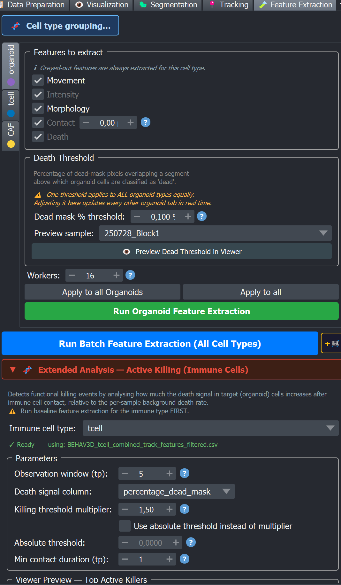

# 🧪 Feature Extraction

Tab 5 of the BEHAV3D EXPLORER dock widget. Feature Extraction takes your **tracked segments** plus the **raw image** and computes, for every cell at every timepoint, a panel of biological measurements (movement, intensity, morphology, contact with neighbours, death). The result is the table that every downstream analysis — Filtering, Death Dynamics, Interaction, and behavioural-state classification — reads from.



## What this tab produces

For each cell type, Feature Extraction writes one combined table:

```
<output_dir>/analysis/<cell_type>/track_features/
    BEHAV3D_<cell_type>_combined_track_features.csv
```

Each row in that CSV = one cell (`TrackID`) at one timepoint (`position_t`). The columns are grouped into six families (see [below](#the-six-feature-families)). Per-sample intermediate CSVs are also written under `trackdata/<sample>/<cell_type>/`.

Optionally, an **Active Killing** detector can run on top of the immune-cell features to flag the timepoints at which an immune cell appears to kill a target. That produces several extra files in `analysis/<immune_type>/active_killing/`.

```{important}
The main **▶ Run Feature Extraction** step writes CSVs only — no plot PDFs. Other tabs produce most QC and behavioural figures ([Filtering](filtering.md), [State Classification](single_cell/state_classification.md), etc.).

Graphics from **this** tab are limited to:

- **Preview Dead Threshold in Viewer** — live napari overlay only (not saved).
- **Active Killing** (immune panel, after baseline extraction) — when you run the analysis or **Display Existing Results**:
  - Per sample: `plots/<sample>/killing_kinetics_summary_<sample>.png` (four panels: efficiency, kinetics, cumulative events, events per cell).
  - All samples: `plots/combined_killing_efficiency_distribution.png`.
  - Top killers: `gallery/<sample>/killing_event_*.gif` (Event GIFs of cropped 3D views (maximum-intensity projections) around each top killing event; count set by **Top-N killers to display**).

See [Active Killing outputs](#active-killing-outputs) for file names; plot interpretation belongs in that section (or a short “Reading the plots” subsection).
```

## Per-cell-type sub-tabs

Like the Tracking tab, Feature Extraction is organised as **sub-tabs per cell type** along the left side. Each cell type declared in the metadata gets its own sub-tab, colour-coded by category:

| Icon | Category |
|---|---|
| 🟣 | Organoid |
| 🔵 | Immune |
| 🟡 | Other |

Multicolor channel splits (e.g. `tcell_1_multicolor`) are **not** shown as separate sub-tabs — the merged track set is used instead.

A collapsible **Active Killing** panel sits at the bottom of the tab, hidden until at least one immune cell type is present.

## The six feature families

Each sub-tab exposes the same six feature-family checkboxes. Some are **mandatory** for certain cell types (the checkbox is forced ON and greyed out, because downstream analyses depend on them):

| Family | What it measures | Mandatory for |
|---|---|---|
| **Movement** | Step length, cumulative distance, mean square displacement, speed, directional persistence | Immune, Other |
| **Intensity** | Mean intensity of each raw channel inside each cell's mask | All cell types |
| **Morphology** | Volume, shape descriptors, surface area, principal axes, orientation | Optional |
| **Contact** | Which neighbours (of any cell type) each cell is touching or close to | All cell types |
| **Organoid Invasiveness** | How much of the immune cell’s surface is in contact with an organoid (0–100%; “invasive” when ≥ about half) | Optional, **immune only**, requires Contact |
| **Death** | Fraction of the cell's mask that overlaps the dead mask, plus a sticky alive/dead flag | Whenever a dead channel exists |

### Per-category summary

| Cell type | Always on (greyed) | Optional |
|---|---|---|
| Organoid | Intensity, Contact (+ Death if dead channel) | Movement, Morphology |
| Immune | Intensity, Contact, Movement (+ Death if dead channel) | Morphology, Organoid Invasiveness |
| Other | Intensity, Contact, Movement (+ Death if dead channel) | Morphology |

## Parameters

Each sub-tab exposes the following spinboxes:

| Control | Default | Range | Units | Meaning |
|---|---|---|---|---|
| **Contact Threshold** | 0.0 | 0.0 – 500.0 | µm | Maximum distance between two cells to be counted as "in contact" (used for distance-based contact columns and `touching_*`). Pixel contact is fixed at one-voxel-diagonal (≈ 1.73 px). Visible only when Contact is checked. |
| **Dead mask % threshold** | 0.1 | 0.0 – 100.0 | fraction (0–1) | Minimum fraction of the cell's voxels that must overlap the dead mask before the cell is flagged as dead. The value is compared **directly** to `percentage_dead_mask` (a 0–1 fraction), so `0.1` means ≈ 10 % of the mask. Set to **0** to skip dead classification entirely. |
| **Preview sample** | first sample | dropdown | — | Sample used by the dead-threshold preview button. |
| **Workers** | balanced default | 1 – (CPU cores − 1) | cores | Parallel workers for image-based computations (morphology / intensity / contact / dead mask). |

```{important}
The **Dead mask % threshold** is **shared across all organoid sub-tabs**. If you change it on one organoid sub-tab, every other organoid sub-tab updates to the same value in real time. Immune and Other cell types each have their own independent threshold.
```

## Preview Dead Threshold in Viewer

The **👁 Preview Dead Threshold in Viewer** button (only visible when Death is enabled — death channel exists ) is the quickest way to set a sensible Dead threshold for a dataset. It:

1. Clears the napari viewer.
2. Loads, for the selected preview sample, the raw channels, the dead mask, and the tracked segments of every cell type.
3. Overlays each cell of the current sub-tab's cell type with a colour based on its dead-fraction:

| Colour | Meaning |
|---|---|
| 🟢 Green | **Alive** — dead-mask overlap **below** threshold |
| 🔴 Red | **Dead** — dead-mask overlap **at or above** threshold |

The overlay updates **live** as you drag the Dead mask % threshold spinner. Hover over any cell to see its track ID and exact dead percentage in the napari status bar.

For organoid sub-tabs, all organoid types are merged into a single overlay so you can see them together.

```{tip}
Picking the dead threshold is dataset-specific, but use these starting points (the value is the fraction of the mask that must overlap the dead signal):

- **Organoids ≈ 0.05** (about 5 % of the mask). It sounds low, but organoids are large 3-D objects, so a few dead cells are only a small volume fraction.
- **T cells ≈ 0.1** (about 10 %, the default). For a clean dead-dye signal there is a clear central red dot.

Adjust from there until the green/red split visually matches the dead cells in your raw image at a timepoint you trust. The binary alive/dead flag is stored alongside the actual intensity and percentage, so you can re-tune later with **▶ Re-run death**.
```

If you already ran extraction with one threshold and want another, change Dead mask % threshold and run ▶ Re-run death

## Active Killing detection (immune cells only)

The collapsible **▶ Extended Analysis — Active Killing (Immune Cells)** section at the bottom of the tab detects, for each immune cell, the **timepoints at which it is likely killing a target organoid**. It only appears when the metadata contains at least one immune cell type, and it requires that the immune cell's combined feature CSV already exists (run baseline Feature Extraction for immune cells first).

### How it works in plain terms

For each sample, the detector first measures the **background death rate** — how fast organoids die on average when no immune cell is around (computed from the first-to-last change in the death signal of every organoid track). Then it looks at each immune cell's contact events with organoids, and for every contact timepoint it asks:

> *Over the next N timepoints, does the death signal on the organoid this immune cell is touching rise faster than the background rate?*

If yes (and contact lasted long enough), that timepoint is flagged `is_active_killing = True`.

### Parameters

| Control | Default | Range | Meaning |
|---|---|---|---|
| **Immune cell type** | first immune type | dropdown | Which immune tracks to analyse. |
| **Observation window** | 5 | 1 – 100 timepoints | How many frames after each contact to measure the death-signal rise on the touched organoid. |
| **Death signal column** | `percentage_dead_mask` | dropdown of `percentage_dead_mask`, `mean_dead_dye`, `nr_dead_mask_pixels` | Which organoid column is read as the "death signal". |
| **Killing threshold multiplier** | 1.5 | 0.1 – 20.0 | If absolute mode is off: the observed death-signal increase must exceed `background_rate × observation_window × multiplier` to count as killing. More robust to staining variation than an absolute number. |
| **Use absolute threshold instead of multiplier** | OFF | checkbox | When on, the multiplier is replaced by a fixed value (next field). |
| **Absolute threshold** | 0.0 | 0.0 – 100.0 | Fixed minimum death-signal increase (only used when "Use absolute threshold" is on). |
| **Min contact duration** | 1 | 1 – 50 timepoints | Minimum consecutive timepoints an immune cell must be in contact with the same target before a killing event can be counted. |
| **Top-N killers to display** | 5 | 1 – 50 | Used by the preview button below. |

### Buttons

- **👁 Load Top Killers in Viewer** — adds a Points layer per top-killing track at every timepoint flagged as killing, so you can scrub through the movie and verify visually.
- **▶ Run Active Killing Analysis** — runs the detector for every sample and writes the output CSVs.
- **+🛒** — queues the analysis with the current parameters.

### Active Killing outputs

Written under `<output_dir>/analysis/<immune_type>/active_killing/`:

| File | Contents |
|---|---|
| `BEHAV3D_<immune_type>_advanced_track_features.csv` | The full immune feature table with extra columns: `is_active_killing`, `killing_efficiency`, `targeted_track_id`, `contact_event_id`, and a `death_signal_increase_<N>tp` column where N is your observation window. |
| `active_killing_per_timepoint_<immune_type>.csv` | One row per contact-event timepoint, with the per-timepoint classification and the background rate used. |
| `active_killing_summary_<immune_type>.csv` | Per-sample aggregates: number of active-killing timepoints, mean killing efficiency, active-killing rate, background rate. |
| `contact_events_<immune_type>.csv` | One row per contact event (start / end timepoint, duration, target track IDs). |
| `plots/combined_killing_efficiency_distribution.png` | Histogram of killing efficiency across all active-killing timepoints. |

## Apply, Run, Queue

Each sub-tab has:

- **Apply to all <Category>s** — copy this sub-tab's settings (feature checkboxes, contact threshold, workers, and the non-organoid dead threshold) to every other sub-tab of the same category.
- **Apply to all** — same but across all cell types.
- **▶ Run <CellType> Feature Extraction** — runs feature extraction for this cell type across every sample. If the combined CSV already exists you'll be asked to **Overwrite** or **Skip**.

The main tab (above the sub-tabs) has:

- **▶ Run Batch Feature Extraction (All Cell Types)** — runs every cell type sequentially.
- **+🛒** — queues a Feature Extraction step in the [Processing Queue](../plugin_essentials/processing_queue). The queue snapshots the current GUI state and applies it at run time.

Progress is reported in the **Log** at the bottom of the tab and in the console (progress bars per per-sample loop).

## Column reference

The combined CSV always contains a base set of identity columns, plus whatever the enabled feature families add.

### Identity / time columns (always present)

| Column | Meaning |
|---|---|
| `sample_name` | Sample identifier |
| `TrackID` | Stable track identifier across timepoints |
| `SegmentID` | Per-timepoint segment label (NaN on interpolated rows) |
| `position_t` | Timepoint index |
| `position_x` / `_y` / `_z` | Centroid in µm |
| `relative_time` | Time within this track, starting at 1 |
| `time` | Real time in hours |
| `distance_unit`, `time_unit` | Always `"um"` / `"h"` |
| `interpolated` | `True` if this row was filled in to bridge a missing frame |

Any extra metadata columns you have in the tracks CSV (e.g. `well`, `condition`) are carried over too.

### Movement (when checked)

All measurements are in µm and hours. Movement is computed only after missing timepoints are interpolated, so all columns are continuous along each track.

| Column | Meaning |
|---|---|
| `displacement` | Step length from the previous timepoint (µm) |
| `cumulative_displacement` | Running total of step lengths |
| `displacement_from_origin` | Straight-line distance from the cell's first position |
| `mean_square_displacement` | Squared distance from origin |
| `directional_persistence` | Cosine similarity of consecutive step vectors (−1 = U-turn, +1 = straight) |
| `speed` | Step length divided by the time between frames (µm/h) |
| `mean_speed` | Speed averaged over the last 10 frames (rolling window) |

```{note}
The Feature Extraction tab does not produce the broader rolling-window motility statistics used by the state classifier (e.g. straightness, net displacement over a window, median turning angle, run-length summaries). Those are computed later from this table by [State Classification](single_cell/state_classification) when you run the HMM — they are not extra columns in the Feature Extraction CSV.
```

### Intensity (when checked)

One column per raw channel:

| Column pattern | Meaning |
|---|---|
| `mean_intensity_ch<N>` | Mean intensity of channel *N* inside the cell's mask |
| `mean_dead_dye` | Convenience alias for the dead channel's mean intensity (only when the metadata declares a `dead_channel`) |

Only **mean** intensity is computed per channel.

### Morphology (when checked)

When Morphology is on, the following are added. Units: volumes in µm³, lengths in µm, surface area in µm².

| Column | Meaning |
|---|---|
| `nr_pixels` | Voxel count |
| `volume` | Physical volume |
| `bbox_volume` | Volume of the axis-aligned bounding box |
| `elongation` | `major_axis_length / minor_axis_length` |
| `extent` | Volume divided by oriented bounding-box volume |
| `equivalent_diameter` | Diameter of a sphere with the same volume |
| `major_axis_length`, `minor_axis_length` | From the inertia tensor |
| `axis1_length` / `axis2_length` / `axis3_length` | Longest / middle / shortest principal axis |
| `oblateness` | Flatness measure based on principal axes |
| `prolateness` | Elongation measure based on principal axes |
| `surface_area` | Marching-cubes mesh area |
| `sphericity` | Sphericity computed from volume and surface area |
| `convex_volume` | Convex hull volume |
| `solidity` | Volume / convex volume |
| `surface_to_volume_ratio` | Surface area / volume |
| `orientation_vector` | The cell's principal-axis direction as a 3-vector |

When Morphology is **unchecked**, only the cheap `nr_pixels` and `volume` columns are kept (the others are skipped to save time).

### Contact (always on — mandatory)

For each other cell type `{type}` present in the metadata, two contact columns and a list:

| Column pattern | Meaning |
|---|---|
| `<type>_contact` | `True` if this cell is **pixel-touching** at least one cell of `<type>` (within ~1.7 px) |
| `<type>_contact_on_distance` | `True` if at least one cell of `<type>` is within the **Contact Threshold (µm)** you set |
| `touching_<type>s` | Comma-separated list of `TrackID`s of `<type>` cells within the distance threshold |
| `any_organoid_contact` / `any_organoid_contact_on_distance` | Aggregated over every organoid type |
| `any_immune_cell_contact` / `any_immune_cell_contact_on_distance` | Aggregated over every immune type |

```{tip}
The `*_contact` columns answer **"is it touching?"** and the `*_contact_on_distance` columns answer **"is it close enough to interact?"**. The default Contact Threshold is 0 µm, which makes the two equivalent. Increase it to 1–5 µm if you care about short-range signalling between cells that don't physically touch.
```

### Organoid Invasiveness (immune only, optional)

When checked (and Contact is also on), for each organoid type `{org}`:

| Column | Meaning |
|---|---|
| `<org>_invasiveness_perc` | Percentage of the immune cell's *surface voxels* (within ~2 µm of its boundary) that are within Contact Threshold of an `<org>` cell |
| `<org>_invasiveness` | `True` when `<org>_invasiveness_perc ≥ 50%` |
| `any_org_invasiveness_perc` | Maximum across all organoid types |
| `any_org_invasiveness` | `True` when any organoid type's invasiveness is ≥ 50% |

This is a **surface-contact fraction**, not a strict "immune voxels inside organoid volume" check — it measures how much of the immune cell's boundary is wrapped by organoid tissue.

### Death (when a dead channel exists and the family is checked)

| Column | Meaning |
|---|---|
| `percentage_dead_mask` | Fraction (0–1) of the cell's voxels that overlap the dead mask |
| `nr_dead_mask_pixels` | Absolute voxel count of overlap |
| `increase_dead_mask` | Change in `nr_dead_mask_pixels` compared to the same cell 10 timepoints earlier — a simple death-rate proxy |
| `dead` | Boolean flag. Once `percentage_dead_mask` crosses the threshold for the first time, the cell is marked dead from that timepoint onward — the flag is **sticky** and never flips back to alive |

If you set the threshold to 0, the `dead` column is not added.

## Tips & best practices

- **Always use the Dead Threshold preview before running.** The green/red overlay is the fastest way to catch a wrong threshold — much faster than rerunning extraction and inspecting a CSV.
- **Use Apply to all category for multi-sample experiments.** Once one organoid sub-tab is correctly tuned, propagate the settings to the others; otherwise it is easy to forget a sub-tab and end up with inconsistent features.
- **Workers parallelise image-based work, not movement.** Movement and death-flag calculation are CPU-cheap and serial. The bulk of wall time is in morphology + intensity + contact + dead-mask measurement, which is what the worker count actually speeds up.
- **Reruns are incremental.** Per-sample intermediate CSVs (intensity, contact, morphology, dead mask) are reused if they already exist on disk and you choose **Skip** in the overwrite dialog — useful when you only need to recompute one feature family. Choose **Overwrite** when you change a threshold and need a clean recompute.
- **Active Killing is opt-in for a reason.** Baseline Feature Extraction is fast; Active Killing has to scan every contact event for every immune track per sample and is much slower. Run it only when you actually need killing-event analysis.
- **Active Killing reads the *filtered* CSV when available.** If you have already run [Filtering](filtering.md), Active Killing will use the filtered feature table rather than the raw one — so it sees the same set of tracks you'll be analysing downstream.

## See also

- [Filtering](filtering.md) — the next step. Drops low-quality tracks and produces QC plots.
- [Death Dynamics & Interaction](death_dynamics) — uses the death and contact columns for population death dynamics and interaction analysis.
- [Single Cell](single_cell/index) — classifies per-cell behavioural states from the movement / contact / morphology table.
- [Output Directory & File Layout](../plugin_essentials/output_layout) — where the CSVs live.
