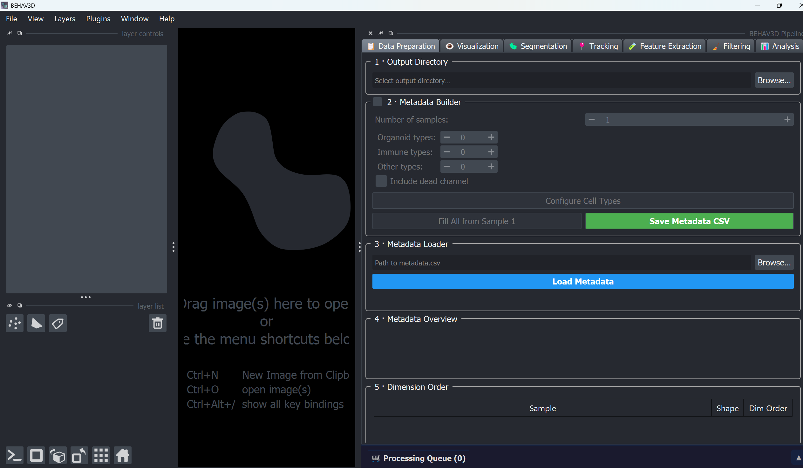

# Getting Started

This page gets you from a fresh `behav3d` install to a running pipeline.

## Launch the BEHAV3D EXPLORER plugin

::::{tab-set}

:::{tab-item} Recommended (one-click)

Double-click the launcher in the `napari/` folder of the repo:

- Windows: `napari/run_behav3d_windows.bat`
- macOS: `napari/run_behav3d_macOS.command`
- Linux: `napari/run_behav3d_linux.sh` (run from a terminal: `chmod +x napari/run_behav3d_linux.sh && ./napari/run_behav3d_linux.sh`)

The launcher reads `napari/.config/behav3d_env.json` (created by the installer), activates the right conda env, starts napari, and adds the BEHAV3D EXPLORER dock widget on the right side of the viewer.

:::

:::{tab-item} Manual

```bash
mamba activate behav3d
napari
```

Then open **Plugins → BEHAV3D EXPLORER** from the napari menu bar. The dock widget appears on the right.
:::

::::



The widget has seven tabs, stacked top to bottom inside the right-hand dock:

| # | Tab | What it does | Detailed page |
|---|---|---|---|
| 1 | 📋 **Data Preparation** | Build / load `metadata.csv`, pick the output directory, set dimension orders, convert raw images to Zarr. | [Data Preparation](data_preparation) |
| 2 | 👁 **Visualization** | Open any sample (raw channels, segments, tracks) in napari layers, used at every step. | [Visualization](plugin_essentials/visualization) |
| 3 | 🦠 **Segmentation** | Six methods: APOC, ConvPaint, Pixel Classifier, Cellpose, Cellpose-SAM (zero-shot), Import existing. | [Segmentation](processing/segmentation/index) |
| 4 | 📍 **Tracking** | Per cell-type subtabs: btrack (objects that do not overlap between frames), fragmentation propagation (objects that do), Bounded Propagation, Reporter Propagation, LapTrack, TrackPy, or Import existing. Manual editing of tracked segments lives in the Visualization tab. | [Tracking](processing/tracking/index) |
| 5 | 🧪 **Feature Extraction** | Movement, intensity, morphology, contact and death features per track. Extended analysis: active killing. | [Feature Extraction](analysis/feature_extraction) |
| 6 | 🧹 **Filtering** | Track-length, experiment-duration, dead-at-t0 and minimal size filters. | [Filtering](analysis/filtering) |
| 7 | 📊 **Analysis** | Population Analysis (signal dynamics, interaction, invasiveness), plus Single Cell behavioural-state and trajectory (track) classification — each ending in a Backprojection step that paints the labels back onto the raw images. | [Analysis](analysis/index) |

At the bottom of the dock widget sits the **🛒 Processing Queue**, a collapsible panel that accepts steps from tabs 3 / 4 / 5 / 6 / 7 and runs them sequentially per sample. See [Processing Queue](plugin_essentials/processing_queue).

## Pipeline tour

This is the happy path. Each step links to its full reference page.

1. **Set up your samples in Data Preparation** ([details](data_preparation))
   - Pick an output directory (everything BEHAV3D EXPLORER writes goes under it).
   - Either build a new `metadata.csv` with the Metadata Builder or load an existing one with the Metadata Loader.
   - Verify the Dimension Order table (default `TCZYX`).
   - Click **Convert to Zarr** to chunk the raw image into timepoint-sized blocks for fast access.
2. **Look at the data in Visualization** ([details](plugin_essentials/visualization))
   - Pick a sample from the dropdown, click **Load Dataset**, toggle Raw / Segments / Tracked Segments / Tracks visibility on/off.
   - You will come back to this tab after every step below to inspect what was just produced.
3. **Segment in Segmentation** ([details](processing/segmentation/index))
   - Pick a method.
   - Either **train** a pixel classifier (APOC / ConvPaint / Pixel Classifier), **load** a pretrained model (Cellpose v3), or run **zero-shot** with no training (Cellpose-SAM). Check the result in Visualization, then batch the rest via the Processing Queue.
4. **Track in Tracking** ([details](processing/tracking/index))
   - One sub-tab per cell type (e.g. *organoid*, *tcell*). Pick a tracking method, set parameters, run.
   - In the Visualization tab the resulting tracked segments can be manually corrected.
5. **Extract features in Feature Extraction** ([details](analysis/feature_extraction))
   - Pick the feature families you want from the six available (movement, intensity, morphology, contact, invasiveness, death). Some are forced on for some cell types — e.g. movement for immune cells, death whenever a dead channel is present. Set the global organoid dead threshold and per-immune/per-other cell types thresholds.
   - You can also run Extended Analysis → Active Killing to detect which effector contacts were followed by a signal rise in the target they touched. Requires baseline feature extraction (with contact + death features) on both cell types first, and the effector must be declared as an immune (`im_`) type. It is explained with the other [population analyses](analysis/population_analysis/index).
6. **Filter in Filtering** ([details](analysis/filtering))
   - Drop tracks shorter than `min_track_length`, optionally cap them at `max_track_length`, drop undersized starting cells with `min_size_t1`, drop dead-at-t0 cells, cap the experiment duration.
7. **Analyse in Analysis** ([details](analysis/index))
   - **💀 Population Analysis** — signal dynamics across your target populations, target–effector interaction, invasiveness, and active killing ([details](analysis/population_analysis/index)).
   - **🧬 Single Cell** — classify each cell's behavioural states over time ([State Classification](analysis/single_cell/state_classification)) and group whole trajectories into clusters ([Track Classification](analysis/single_cell/track_classification)).
   - Each Single Cell workflow ends with a **Backprojection** step that overlays the behavioural-state / track-cluster labels on the raw images so you can sanity-check the analysis and export figures or movies.

## Next steps

- → Deep dive on the cross-tab tools: [Plugin Essentials](plugin_essentials/index)
- → Full reference: [Data Preparation](data_preparation)
- → Processing section (Segmentation + Tracking): [Processing](processing/index)
- → Analysis section: [Analysis](analysis/index)
