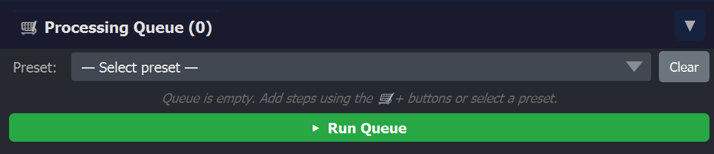

# 🛒 Processing Queue

The Processing Queue is the collapsible panel at the bottom of the BEHAV3D EXPLORER dock widget. It batches steps from segmentation / tracking / feature extraction / filtering and runs them sequentially per sample, so you can leave a long pipeline running overnight and come back to results in the morning.



## Why it exists

Running each step manually from its tab is fine for testing and checking. But once you've decided what to segment, track, feature-extract and filter across the whole experiment, the queue:

- Bundles every step you need into one list.
- Snapshots the **parameters at add-time**, so changes you make in a tab after queueing don't affect the queued step.
- Resolves **dependencies automatically**, if you queue *Filter* without having queued *Feature Extract*, it prompts to add it.
- Sorts steps by their canonical pipeline order before running.
- Reports progress and elapsed time per step, and surfaces errors clearly.

## Step types

| Step | Source tab | What it does |
|---|---|---|
| 🧠 `TRAIN` | Segmentation | Train segmentation classifiers on the labelled examples |
| 🦠 `SEGMENT` | Segmentation | Run segmentation using the trained classifiers |
| 📍 `TRACK` | Tracking | Batch tracking across cell types |
| 🧪 `FEATURE_EXTRACT` | Feature Extraction | Compute per-track features |
| 🔥 `ACTIVE_KILLING` | Feature Extraction | Detect immune-cell killing events |
| 🧹 `FILTER` | Filtering | Track-length / dead-at-t0 / experiment-duration filters |

Each step has a **canonical order** so even if you add them out of sequence, the queue runs them in pipeline order.

## How to add a step

Each tab has a **🛒+ button** that adds its current parameter snapshot to the queue. Example:

- *Tracking*: "🛒+ Track"
- *Feature Extraction*: "🛒+ Feature Extract"

## Dependency prompts

When you add a step that needs upstream data and that data is missing, the queue pops a question dialog. Example:

| Added | If missing | Prompt |
|---|---|---|
| `TRACK` | Segmentation data for some samples | "Would you like to add Batch Segmentation to the pipeline?" |

Click **Yes** to insert the missing step before the one you just added, **No** to cancel.

```{note}
Re-running a step whose own outputs already exist is allowed but is not silent. When you click **▶ Run Queue**, BEHAV3D EXPLORER pops an **"Overwrite Existing Data?"** dialog listing every output that would be touched, with three choices:
- **Overwrite All** — re-runs every queued step and overwrites the existing files.
- **Skip Existing** — only runs steps whose outputs are missing.
- **Cancel** (default) — aborts the run, the queue is left untouched.
```

## Presets

Three one-click presets are exposed via the dropdown:

| Preset | Expands to |
|---|---|
| **Train + Segment + Track** | TRAIN → SEGMENT → TRACK |
| **Segment + Track** | SEGMENT → TRACK |
| **Segment → Filter** | SEGMENT → TRACK → FEATURE_EXTRACT → FILTER |

Pick a preset and the steps populate. You can still edit individual steps' parameters afterwards (by going back to the tab that owns them) and reorder by removing + re-adding.

## Running the queue

Click **▶ Run Queue**. Behaviour:

- Steps run **sequentially**, in canonical pipeline order, **for every sample in the metadata**.
- The status icon next to each row shows: ⏸️ pending → ⏳ running → ✅ done (or ❌ on error).
- Elapsed time is printed once a step finishes (e.g. `12s`, `3.4m`).
- If a step errors, the queue **stops** (does not silently continue) and the row turns red. Open the queue body to see the error message.
- The queue badge in the toggle bar shows the total step count and turns yellow when there are pending steps.

## Removing / clearing

- **x** at the right of each row removes that step (only while the queue is not running).
- **Clear** wipes the whole list. Useful between experiments.
- A queued `SEGMENT` row also removes its paired `TRAIN` (since they're conceptually one unit).

## What the queue does *not* do

- It does not parallelize across samples, each step is heavy enough that running them sequentially is usually optimal anyway.
- It does not auto-restart on crashes. If the process dies, you re-launch napari and re-queue.
- It does not save/load queue presets to disk.
