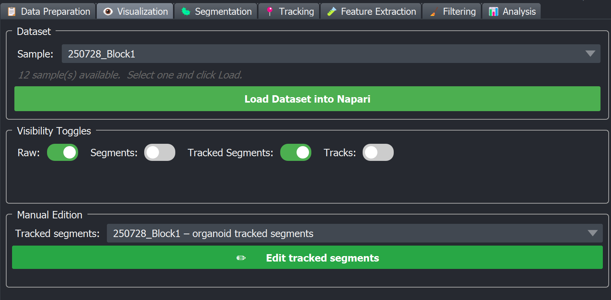

# 👁 Visualization tab

The Visualization tab is tab 2 of the BEHAV3D EXPLORER dock widget. Despite its position you actually come back to it after every step of the pipeline, it's the panel that loads any sample's raw image, segmentation masks, tracked-segment labels and tracks CSV into napari layers so you can inspect what just got produced.



## What this tab does

1. Reads the metadata loaded in the Data Preparation tab.
2. Lists every sample in the dropdown.
3. On **Load Dataset into napari** for the selected sample, opens four kinds of napari layers:
   - **Raw channels** — one image layer per channel
   - **Segments** — labels layers, one per cell type
   - **Tracked Segments** — labels layers showing the cell IDs after tracking (each cell keeps the same colour across timepoints)
   - **Tracks** — a napari Tracks layer drawn from each cell type's tracks
4. Provides toggle switches to show/hide each group quickly, plus a Manual Edition panel that drops the user into the [Manual Editing](../processing/tracking/manual_editing) workflow on a chosen tracked-segments layer

## Where the data comes from

The tab reads paths derived from the metadata + output directory, in this order:

| Layer group | Source files |
|---|---|
| **Raw** | `raw_image_path` from metadata, the `.zarr` version under `output_dir/images/{sample}/{sample}.zarr` (created by the *Convert to Zarr* step in Data Preparation). |
| **Segments** | `output_dir/images/{sample}/{sample}_{cell_type}_segments.zarr` for each cell type detected in the metadata. |
| **Tracked Segments** | `output_dir/images/{sample}/{sample}_{cell_type}_tracked.zarr`. |
| **Tracks** | `output_dir/trackdata/{sample}/{cell_type}/{sample}_{cell_type}_tracks.csv`. |

Anything that doesn't exist yet (e.g. you haven't tracked yet) is skipped.

## Layer naming and colours

**Raw channels** cycle through the palette `cyan → yellow → green → red → blue → magenta` (the palette wraps around if you have more than six channels), and are named by channel index: `{sample} – Ch0`, `{sample} – Ch1`, …

**Segments**, **Tracked Segments** and **Tracks** layers are named after the cell type you defined in your metadata, e.g. `{sample} – tcell segments`, `{sample} – organoid tracked`, `{sample} – tcell tracks`. They use napari's default labels colormap (one random colour per integer ID).

Colours can be changed manually from the napari **Layer Controls** panel.

## Workflow

### 1. Load metadata first

Until metadata is loaded in the Data Preparation tab, the Visualization tab shows "⚠️  No metadata loaded." After loading, the sample dropdown populates and the info label reports "N sample(s) available. Select one and click Load."

### 2. Pick a sample and click Load Dataset

The tab:

- Clears any existing napari layers (so you start fresh).
- Resets the visibility toggles to: Raw ✓, Segments ✓, Tracked Segments ✓, Tracks ✗ (Tracks are hidden by default, toggle them on when you need them).
- Loads the data and time-lapse opens within seconds.

### 3. Toggle layer groups

| Toggle | Shows | Typical use |
|---|---|---|
| **Raw** | All raw image channels | Inspect signal quality, identify dim/bright cells |
| **Segments** | Per-cell-type segmentation labels | Inspect segmentation quality, identify under/over-segmentation |
| **Tracked Segments** | Tracking output (each cell keeps the same colour) | Spot track ID swaps, broken tracks, identity jumps |
| **Tracks** | The Tracks layer (lines through time) | Look at trajectories, especially with the time slider |

### 4. Manual Edition (optional)

When at least one `*_tracked.zarr` layer is present, the **Manual Edition** group becomes visible. Pick the cell type from the dropdown, click **✏️ Edit tracked segments**, and a Tracked Segment Editor appears (the same widget documented under [Manual Editing](../processing/tracking/manual_editing)).

```{warning}
If you have unsaved manual edits and try to switch to another tab, BEHAV3D EXPLORER pops a "Save / Discard / Cancel" dialog. Don't ignore the dialog or you'll lose work.
```

## When to use it

| After this step… | …open Visualization to check |
|---|---|
| Data Preparation (zarr conversion) | Did the raw zarr open correctly? Are the channels in the right order? |
| Segmentation | Are masks tight to the cell boundaries? Any background bleed? Any cells split into pieces? |
| Tracking | Do cells keep the same colour over time? Any teleporting or merging? |
| Filtering | Do the surviving tracks look sensible after removing short / dead-at-t0 ones? |

## Tips

- The Tracks layer is **off by default** because it can be visually noisy. Turn it on when you want to inspect motility / displacement.
- The Raw toggle hides *all* raw channels at once, convenient when you want to focus only on masks.
- The log panel at the bottom prints exactly which paths were resolved or skipped, use it to diagnose "why don't I see my segments?".

## See also

- The [Output Directory & File Layout](output_layout) page lists every path the Visualization tab reads from.
- For per-cell-type segment editing: [Manual Editing](../processing/tracking/manual_editing).
