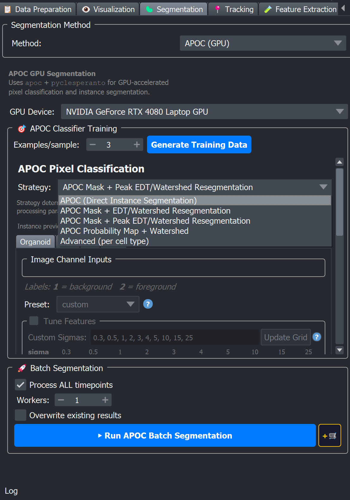

# ⚡ APOC (GPU)

APOC ([Accelerated Pixel and Object Classifiers](https://github.com/haesleinhuepf/apoc)) is the **GPU pixel classifier** option in BEHAV3D EXPLORER. It computes image features on the GPU, then trains a Random Forest classifier on those features. Once trained, the classifier runs on the GPU to predict the class of every voxel in your image.

Pick it when:
- Your computer has a dedicated or integrated GPU.
- You want fast training and batch processing.
- Your objects have clear boundaries or intensity differences from the background. For subtler textures, see [ConvPaint](convpaint).



## Strategies

The strategy combo at the top of the training area controls how a trained classifier is turned into instance labels:

| Strategy | What APOC outputs | How it becomes instance labels |
|---|---|---|
| **APOC (Direct Instance Segmentation)** | Already-labelled instances. | None, the output is used as-is. |
| **APOC Mask + EDT/Watershed Resegmentation** | Foreground vs. background mask. | Euclidean Distance Transform of the mask → threshold → watershed seeds → watershed → size filter. |
| **APOC Mask + Peak EDT/Watershed Resegmentation** | Foreground vs. background mask. | Same idea, but watershed seeds are placed at *peaks* of the EDT, better for densely-packed objects with clear central peaks. |
| **APOC Probability Map + Watershed** | Per-voxel foreground probability. | A mask threshold defines foreground; a higher seed threshold defines watershed seeds; watershed splits touching objects on the probability map. |

```{tip}
**Direct Instance Segmentation** is the simplest and fastest, but assumes your cells are already well-separated by the pixel classifier alone. The three watershed variants exist because biological cells in 3D very often touch, pick the one whose post-processing matches your object morphology and tune its parameters in the per-cell-type tab. Start by previewing: use Direct Instance Segmentation and click **Run instance segmentation**; if cells are merged switch to APOC Mask + EDT/Watershed (use Peak EDT for very dense objects) or APOC Probability Map + Watershed for fuzzy boundaries.

```

## Step-by-step in the napari plugin

A full session usually goes like this:

1. **Open the Segmentation tab** → pick **APOC (GPU)** from the method dropdown.
2. **Pick the GPU** from the `GPU Device` dropdown.
3. **Pick a strategy.** Start with **APOC (Direct Instance Segmentation)**, it's the fastest end-to-end and you only need to swap to a watershed variant if cells turn out to touch and the labels need splitting.
4. **Set `Examples / sample`** (default 3 is usually fine) and click **Generate Training Data**. The viewer loads timepoints from the start, middle and end of each sample as Image layers plus an empty Labels layer per cell type.
5. **Paint a few foreground and background pixels** on the Labels layer for each cell type — see [Labeling foreground and background](./index.md#labeling-foreground-and-background) for the painting convention and labeling tips.
6. **Go to the per cell-type tab** (one tab per cell type at the top of the training area) and review the per-type controls: `Image Channel Inputs`, `Feature Preset` / `Tune Features`, and Random Forest parameters. Defaults are sensible; the most common manual change is unchecking irrelevant channels in `Image Channel Inputs`.
7. **Click `▶ Train current tab`** to fit the classifier for the active cell type, or **`▶▶ Train ALL classifiers`** to train every cell type at once. Use **`⬇ Apply config to all tabs`** beforehand if you want one tab's feature/RF settings copied to the others, and **`💾 Save User Labels`** to persist the labels you painted.
8. For non-Direct strategies, instance-segmentation parameters (EDT / mask & seed thresholds / opening / min size / peak settings) are exposed in the per-tab **Instance Segmentation Preview** group before you train, adjust these to control how the classifier output is turned into instances. After training the per-tab preview will be updated (usually automatically); you can also click **Run instance segmentation** in a cell-type tab to re-run the classifier + post-processing preview on the current timepoint without retraining.
9. **Inspect the result.** If touching cells are merged, single cells split, or noise appears, see [Tuning the parameters](#tuning-the-parameters) and adjust the per-tab segmentation parameters. Note: **APOC (Direct Instance Segmentation)** uses classifier-produced instance labels as-is, so if you need splitting or cleanup, switch to a Mask/Peak/Probability + Watershed strategy.
10. **Scroll to  Batch segmentation section** → pick timepoint range and workers → click **▶ Run APOC Batch Segmentation** for an immediate run, or **+🛒** to queue.

### 1 · GPU device

`GPU Device` dropdown at the top of the APOC tab lists every device the system can see. Pick a discrete GPU if you have one; integrated GPUs work but are much slower for large volumes.

### 2 · Strategy + Training

| Control | Default | Effect |
|---|---|---|
| **Strategy** | APOC (Direct Instance Segmentation) | One of the five strategies listed above. Changing it rebuilds the per-cell-type instance-preview controls. |
| **Examples / sample** | 3 | Number of timepoints randomly sampled from each metadata row as training data (range 1–10). |
| **Generate Training Data** | — | Clears the viewer and loads those timepoints as Image layers + empty Labels layers per cell type. |

APOC is a binary classifier with one Labels layer per cell type (`1` = background, `2` = foreground). See [Labeling foreground and background](./index.md#labeling-foreground-and-background) for the painting convention and labeling tips shared by all pixel-classifier methods.

### 3 · Per cell-type tab

A tab is created for each cell type detected in the metadata. Each tab exposes:

| Control | Default | Effect |
|---|---|---|
| **Image Channel Inputs** | All raw channels checked | Tick the raw channels this classifier should see. |
| **Cell type strategy** (Advanced mode only) | Mirrors the global strategy | Lets you pick a different strategy for this cell type only. |
| **Feature Preset** | `medium_quick` | Pre-configured grid of feature filters × sigmas. The dropdown lists four options: `small_quick` (smallest grid, fastest), `medium_quick` (balanced default), `large_quick` (largest grid, slowest/best quality) and `custom` (starts empty — define your own grid in *Tune Features*). |
| **Tune Features** (collapsible) | Collapsed by default | Feature × sigma checkbox grid + a `Custom Sigmas` line edit (comma/space-separated). Available sigmas: `0.3, 0.5, 1, 2, 3, 4, 5, 10, 15, 25`. Feature rows are Gaussian blur (Gauss), Difference of Gaussian (DoG), Laplacian of Gaussian (LoG) and Sobel of Gaussian (SoG). Each checked feature × sigma combination becomes one column of the feature matrix. Editing the grid switches the preset to `custom`. |
| **Consider original image as well** | OFF | Adds raw pixel intensity as an extra feature column. Useful when intensity alone is highly discriminative. |
| **Max depth** | 2 | Maximum depth of each decision tree (range 1–20). Shallow trees (2–5) train fast and generalise well. |
| **Trees** | 100 | Number of decision trees in the random forest (range 10–1000, step 10). |
| **Show classifier statistics** | — | After training, displays the classifier's feature-importance distribution, useful for spotting under- or over-fitting and identifying uninformative features you can disable to speed up future runs. |

When the strategy includes a watershed post-processing, an **Instance Segmentation Preview** group also appears. Parameter meanings and tuning are documented once in [Instance post-processing parameters](./index.md#instance-post-processing-parameters); which ones are shown, and their APOC defaults, are:

| Strategy | Parameters shown (with APOC defaults) |
|---|---|
| **APOC (Direct Instance Segmentation)** | none — instance labels come directly from the classifier output, no post-processing controls. |
| **APOC Mask + EDT/Watershed Resegmentation** | EDT threshold `1.0`, Opening px `0`, Min size `10`, Fill holes `True`. |
| **APOC Mask + Peak EDT/Watershed Resegmentation** | EDT threshold `1.0`, Peak min dist `0.0`, Peak min ratio `0.35`, Opening px `0`, Min size `10`, Fill holes `True`. |
| **APOC Probability Map + Watershed** | Mask threshold `0.5`, Seed threshold `0.8`, Opening px `0`, Min size `10`. |

The defaults in the table are the **same on every tab** the first time you open APOC — only a starting point. For tips on tuning **large vs small** objects (shared with ConvPaint and Pixel Classifier), see [Advice: large vs small objects](./index.md#advice-large-vs-small-objects) on the [segmentation overview](./index.md).

### 4 · Train + Preview

- **▶ Train current tab** / **▶▶ Train ALL classifiers**: fit the APOC classifier for the active cell type, or for every cell type at once. The trained model is saved to `<output_dir>/images/PixelClassification/` (one file per cell type per strategy).
- **Run instance segmentation** (per cell-type tab): the per-tab button labeled "Run instance segmentation" starts the preview flow in the Napari plugin: the plugin clears any stale preview layers for that cell type, selects the GPU, runs the classifier on the currently displayed timepoint (or re-uses an existing probability layer when present), applies the chosen post-processing, and updates the viewer.

- Preview viewer layers (exact names):

- `"<CellType> Segments"` — Labels layer containing the instance preview (for the special `dead` cell type this label layer is named `Pixel Classification (Dead)`).
- `"Probability Map (<CellType>)"` — Image layer with per-voxel probabilities (for `dead` this is `Probability Map (Dead)`).

- Behavior details: the plugin replaces or updates any existing viewer layers with the same name (i.e., reuses the layer name and sets its `.data`), and removes stale preview layers at preview start. The preview is primarily GUI-only and recreated on each run to let you iterate quickly on EDT / mask & seed thresholds, Opening, Min size and Peak settings.

- Optional persistence: when a PixelClassification output folder is configured the preview routine will also write preview arrays to the PixelClassification preview paths (e.g. `PixelClassifier_<CellType>_PredictedLabels.zarr` and `PixelClassifier_<CellType>_ProbabilityMap.zarr`). For full, per-sample segmentation outputs use `▶ Run APOC Batch Segmentation`, which writes `<output_dir>/images/<sample>/<sample>_<cell_type>_segments.zarr`.

## Tuning the parameters

Use the per-cell-type **Run instance segmentation** button between every change. Two groups of parameters matter: the **classifier** (random forest) and the **post-processing** (the watershed parameters that appear when you pick a non-Direct strategy).

**Classifier — `Feature Preset` and the `Tune Features` grid**

APOC does not classify raw voxels directly. For each checked **Image Channel Input**, it builds a stack of derived images (one per checked **filter × sigma** in the grid, plus optional raw intensity), and the Random Forest learns from that stack. More checked boxes → more columns → usually more detail but slower training and inference and more GPU memory.

**What each filter row means** (names in the grid match the UI):

| Row | What it emphasises | Typical use |
|---|---|---|
| **Gauss** | Smoothed intensity at scale σ — blobs and gradual intensity changes. | Large, soft objects; reducing high-frequency noise before other filters. |
| **DoG** | Difference between two Gaussian blurs — **edges** and thin structures at scale σ. | Boundaries between cell and background; common default in all presets. |
| **LoG** | Laplacian-of-Gaussian — **blob-like** bright/dark spots at scale σ (peaks and valleys). | Round nuclei, organoid cores, spot-like markers. |
| **SoG** | Sobel-of-Gaussian — **directional edges** (gradient magnitude) at scale σ. | Membranes and elongated boundaries. |

**Sigma (σ)** is the width of the Gaussian blur **in pixels** before each filter is applied (same units as your image axes in napari). It is **not** a probability (not “50%”) and not microns unless your data happen to be 1 pixel = 1 µm.

| σ value | Rough neighbourhood size | What the classifier “sees” at that scale |
|---|---|---|
| **0.3 – 0.5** | Sub-pixel to ~1 px | Fine texture, shot noise, very thin edges — only useful if objects are only a few pixels wide or you need micro-detail. |
| **1 – 2** | ~2–4 px across | Small cells, nuclei, tight boundaries (common in `small_quick` / `medium_quick`). |
| **3 – 5** | ~6–10 px across | Medium cells, organoid rims, local context around one object. |
| **10 – 15** | ~20–30 px across | Large clusters, organoid bodies, slow background gradients over a patch. |
| **25** | ~50 px across | Very coarse field context; whole-organoid or tissue-scale shading. |

**Rule of thumb:** pick σ in the same ballpark as **half the diameter (in pixels)** of the structure you want that filter to describe. Example: a nucleus ~8 px wide → try **LoG** or **DoG** at σ **`2–4`**; an organoid ~200 px wide → add σ **`10–25`** (as in `large_quick`), not only σ `0.5`.

The grid columns come from the **Custom Sigmas** list (defaults: `0.3, 0.5, 1, 2, 3, 4, 5, 10, 15, 25`). Click **Update Grid** after editing that list. A preset is just a pre-checked subset of filter×sigma pairs:

| Preset | Checked pairs (approx.) | When to use |
|---|---|---|
| `small_quick` | 4 | Fast iteration; small objects; limited GPU memory. |
| `medium_quick` | 8 | Default balance for most cell types. |
| `large_quick` | 20 | Noisy or multi-scale data; objects vary a lot in size within one field. |
| `custom` | You choose | After you know which rows matter; edit the grid manually. |

Changing preset **replaces** the checkbox grid with that preset’s pattern (same behaviour as picking a new preset in the UI).

**Failure modes → what to try**

- Mask looks **fragmented or speckled** → try `large_quick`, or add larger σ values in *Tune Features* (e.g. include `5`, `10`) so the classifier sees broader context.
- **Training or preview is too slow** / GPU runs out of memory → use `small_quick` or `medium_quick`; uncheck redundant **channels**; in *Tune Features*, uncheck whole filter rows or large σ columns you do not need.
- **Under-segmentation** (merged objects) with a good mask → often post-processing (strategy / EDT), not features — but if boundaries look blurry in the probability map, add **DoG** or **SoG** at σ `1–2` before cranking RF depth.

**Which channels to keep in `Image Channel Inputs`**

Each checkbox is a **raw imaging channel** the classifier may use. The forest does **not** know your metadata — it only learns “label `2` = foreground for **this** cell-type tab.” Check channels that help it **tell foreground apart from everything else**, including other objects in the same volume.

Typical pattern on the **organoid** tab:

- Check the channel(s) where **organoids** are.
- Also check a channel where **confounders** stand out — e.g. a **T-cell** — so the model learns that T-cell voxels are **not** organoid foreground. Without that cue, organoid foreground can spill into space occupied by T cells.

Practical steps:

1. In napari, toggle channel visibility and overlay the **Labels** layer for this tab. For each candidate channel, ask: *“Does this channel help discriminate what I painted as foreground from what I left as background (and from other cell types)?”* If yes, leave it checked.
2. Start with a sensible superset (often all channels), `medium_quick`, train once, and run **Run instance segmentation**.
3. Uncheck channels that add **no** discrimination.
4. **Ablation:** uncheck one channel, retrain, compare preview — if organoids bleed into T-cell regions (or vice versa), put that discriminative channel back.

More checked channels → more feature columns and slower runs; keep the set that improves **separation**, not every channel “just in case.”

**`Show classifier statistics` and “dominating” features**

After training, **Show classifier statistics** opens a table of **feature importance** (one row per filter×sigma×channel combination, e.g. `difference_of_gaussian_sigma2_channel0`). Higher importance means the forest relied on that column more when splitting.

- **One row dominates** (much higher than the rest). Often the classifier found one strong cue (e.g. a T-cell channel at σ `2`). It is a problem if preview looks **overfitted** to your painted labels, or if importance is high on a **noisy or artefact** channel you should disable.
- **Many rows near zero** → safe to uncheck those filter×sigma boxes in *Tune Features* (or drop channels) and retrain for a faster, leaner model.
- **Dominating filter** means a **specific row in the grid** (e.g. `DoG` at σ `1`). Fix by unchecking that row if it is redundant, or by fixing labels/channels if the model is latching onto the wrong cue.

Enable **Consider original image as well** only when raw intensity alone separates foreground and background (very bright nuclei, etc.); otherwise the multiscale filters are usually enough.

**Classifier — `Max depth` and `Trees`**

- Both default values (depth 2, 100 trees) are deliberately conservative. APOC examples and the help-text recommend shallow trees because pixel classification uses small label sets.
- **Raise `Max depth`** (3–5) only if the classifier is clearly under-fitting on textured backgrounds. Do not go above 8 unless you have a strong reason; deep trees overfit the painted pixels.
- **Raise `Trees`** (e.g. 100 → 200) for a small accuracy gain at the cost of training time and GPU memory. Diminishing returns past ~200.

**Strategy choice**

- Cells in your data **never touch** → use **Direct Instance Segmentation**. No watershed parameters to tune.
- Cells touch and the binary mask is clean → use **APOC Mask + EDT/Watershed**.
- Cells are very densely packed with clear central peaks → use **APOC Mask + Peak EDT/Watershed**.
- The classifier output is **uncertain at boundaries** (see below) → use **APOC Probability Map + Watershed** and tune **Mask threshold** / **Seed threshold** instead of the Mask+EDT strategies.

**Post-processing parameters (EDT / mask & seed thresholds / Opening / Min size / Peak settings)**

- If watershed results look wrong (merged cells, speckles, etc.), see [Tuning (failure mode → fix)](./index.md#instance-post-processing-tuning) on the [segmentation overview](./index.md) — the same tips apply to APOC, ConvPaint, and Pixel Classifier.

### 5 · Batch segmentation

Standard batch controls — see [Batch segmentation controls](./index.md#batch-segmentation-controls). The run/queue buttons here are **▶ Run APOC Batch Segmentation** and **+🛒**.

## Outputs

| File | Path |
|---|---|
| Per-cell-type instance labels | `<output_dir>/images/<sample>/<sample>_<cell_type>_segments.zarr` |
| Trained APOC classifiers | `<output_dir>/images/PixelClassification/` — one file per cell type per strategy. |

## Good practices & tips

- **Start with `medium_quick` preset + Direct Instance Segmentation.** It's the fastest combination to verify your labels are useful. Only escalate to watershed strategies / the `large_quick` preset if the result is unclean.
- **Keep RF trees shallow (max depth 2–5).** This is the default, and is what the help-text and most APOC examples recommend. Deep trees overfit on small label sets, which is the typical regime for interactive pixel classification.
- **Use *Show classifier statistics* after training.** If a single feature dominates the importance distribution, you may be under-labelled or over-relying on one channel.
- **Workers are not the bottleneck.** APOC inference is GPU-bound; setting workers > 1 mainly parallelises zarr I/O between samples. Leave at 1 unless you observe disk-bound behaviour.
- **Several cell types (large and small)?** See [Advice: large vs small objects](./index.md#advice-large-vs-small-objects) on the overview; use **Advanced (per cell type)** when each type needs a different strategy.

**Image Channel Inputs** — see the channel-selection steps under **Classifier — Feature Preset** above; use per-cell-type tabs in Advanced mode when organoids and immune cells need different channel sets.

## Things this page does **not** claim

- Per-timepoint inference time numbers — they depend strongly on your GPU, volume size, and channel count. Profile your own data; there is no benchmark in the code.
- That APOC always beats ConvPaint or Pixel Classifier. This is dataset-dependent; the choice of features is what matters.

## See also

- [Segmentation overview](./index.md) for the method comparison.
- [ConvPaint](convpaint) — deep-features alternative when classical features aren't enough.
- [Processing Queue](../../plugin_essentials/processing_queue) for batching training and segmentation steps.
- [APOC project on GitHub](https://github.com/haesleinhuepf/apoc) — upstream documentation.
