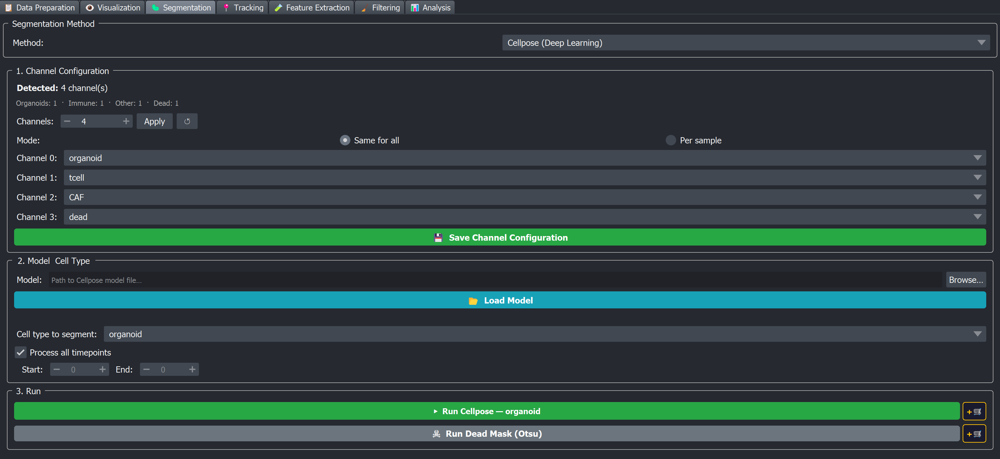

# 🔬 Cellpose

Cellpose is the **classic deep-learning instance segmenter** (cellpose v3) in BEHAV3D EXPLORER. Unlike the pixel-classifier methods, Cellpose is *not* a pixel classifier — it outputs cell-level instance labels directly from raw intensities, using a pretrained convolutional neural network ([Stringer et al., Nature Methods 2021](https://www.nature.com/articles/s41592-020-01018-x)).

```{note}
This page covers **classic Cellpose (v3)**, where you load a pretrained or retrained model file. If you want the newer zero-shot foundation model that needs **no model and no training**, see [Cellpose-SAM (zero-shot)](cellpose_sam) instead — it runs cellpose v4 in a separate sidecar environment.
```

Classic Cellpose loads a pretrained or retrained model file — the models are trained on full segmentation masks, not painted points, so they cannot be fine-tuned from the napari plugin itself (see the [Cellpose Training Notebook](../../cellpose_training)). For method choice across all six segmentation options, see the [segmentation overview](./index.md#how-to-pick-a-method).



## Pretrained models

The pretrained Cellpose models on Zenodo:

→ **[BEHAV3D Pretrained Cellpose Models](https://zenodo.org/records/18872978)**

Download the model folder you need and point Cellpose at it via the **Browse…** button in the widget.

```{note}
Which specific models are bundled, and what cell types each one was trained on, is documented on the Zenodo page itself.
```

If none of the published models fit your sample, you can fine-tune one on your own labels using the [Cellpose Training Notebook](../../cellpose_training).

## Step-by-step in the napari plugin

A typical session goes like this:

1. **Download a pretrained model** from the [Zenodo deposit](https://zenodo.org/records/18872978) (or train your own with the [Cellpose Training Notebook](../../cellpose_training)).
2. **Open the Segmentation tab** → pick **Cellpose (Deep Learning)** from the method dropdown.
3. **Set up the Channel Configuration (Section 1).** 
   - Pick **`Same for all`** if every sample has the same channel order, or **`Per sample`** if it varies.
   - For each channel slot, pick which cell type (or `dead`, or `(unused)`) it represents from the dropdown.
   - Click **💾 Save Channel Configuration**.
4. **Browse to the model directory** in Section 2 → click **📂 Load Model**.
5. **Pick the cell type to segment** from the dropdown. Pick the timepoint range (or check `Process all timepoints`).
6. **Click ▶ Run Cellpose.** Inspect the result for one sample first by loading it in the Visualization tab afterwards.
7. **If you have other cell types** that use a different model (e.g. one model for organoids, a separate one for T cells), repeat steps 4–6 with the other model. The Cellpose tab does not let you preview before launching the batch — each run goes over every sample directly, so do step 6 on a small `Start / End` range first.
8. **If your dataset has a dead-stain channel**, click **☠ Run Dead Mask (Otsu)** at the bottom of Section 3 to produce the dead mask (used later by Feature Extraction).
9. **Queue everything** (Cellpose + Dead Mask) via the **+🛒** buttons if you prefer to launch the rest of the pipeline together — see [Processing Queue](../../plugin_essentials/processing_queue).

The widget is split into three sections.

### Section 1 · Channel Configuration

This section maps **raw image channel index → cell type label**.

| Control | Effect |
|---|---|
| **Detected: N channel(s)** | Auto-detected channel count from the metadata (one channel per cell type plus one for the dead channel, when present). |
| **⚙ Set Manually** + spinbox + **Apply** + **↺** | Override the channel count when the raw zarr has more channels than the metadata declares. The extra slots get a `none` option. |
| **Mode: Same for all / Per sample** | "Same for all" sets one mapping that applies to every sample. "Per sample" lets each sample have its own mapping (useful when channel order varies). |
| **Per-channel dropdown** | One dropdown per channel slot. Options are the cell types declared in metadata plus `dead` (if a dead channel is present) plus `(unused)` / `none` when overriding the count. |
| **💾 Save Channel Configuration** | Persists the mapping to `behav3d_parameters.yml` (under the `cellpose` key). |

```{warning}
The channel mapping is critical. Cellpose expects the raw image with a specific channel order — if you mis-map, the model sees the wrong intensities. Always check the Channel Configuration before running a batch.
```

### Section 2 · Model & Cell Type

| Control | Effect |
|---|---|
| **Model** (text field) + **Browse…** | Path to the Cellpose model directory (the one downloaded from Zenodo or trained yourself). |
| **📂 Load Model** | Loads the model. |
| **Cell type to segment** | Dropdown of cell types from the metadata. The Run button text updates to reflect the selection. |
| **Process all timepoints** (checkbox) | When checked, segments every timepoint. When unchecked, the `Start` / `End` spinboxes become active. |
| **Start / End** | Inclusive timepoint range (0-based). |

### Section 3 · Run

| Control | Effect |
|---|---|
| **▶ Run Cellpose** | Runs immediately on every sample in the metadata, for the selected cell type, using the loaded model. Blocks the GUI until done. |
| **+🛒** | Queues a Cellpose step in the [Processing Queue](../../plugin_essentials/processing_queue). The queue allows multiple Cellpose steps with different (model, cell type) pairs — useful when one model handles organoids and another handles immune cells. |
| **☠ Run Dead Mask (Otsu)** | Only visible when the metadata has a dead channel. Computes one global Otsu threshold over the requested timepoint range and writes a binary mask per timepoint to `<output_dir>/images/<sample>/<sample>_mask_dead.zarr`. |
| **+🛒** (next to the Otsu button) | Queues the Dead Mask step. |

## What runs under the hood

For each timepoint the plugin loads the raw volume, hands it to the Cellpose model, and writes the resulting instance labels to disk. A few inference settings are fixed:

| Setting | Value | Notes |
|---|---|---|
| 3-D mode | always on | All segmentation is performed in 3-D (`do_3D=True`). |
| Per-image normalization | always on | `normalize=True`. |
| Auto-diameter | yes | `diameter` is not set, so the model estimates the cell diameter from the image. |
| Minimum object size | category-dependent | Set automatically from the cell type's category: **1000 voxels** for organoids, **10 voxels** for immune / other cells. Smaller objects are dropped. |
| Anisotropy (Z : XY voxel ratio) | from metadata | Computed **per sample** as `pixel_distance_z / pixel_distance_xy` from your metadata and passed to Cellpose. It is **not** a fixed value. |

```{important}
None of these are exposed in the GUI. The anisotropy Cellpose uses is taken directly from your metadata (`pixel_distance_z / pixel_distance_xy`), so it adapts to your acquisition automatically — **provided those pixel-size values in the metadata are correct**. If they are wrong, the model's behaviour in Z will be off; fix the pixel sizes in the metadata first.
```

## Tuning the result

Cellpose differs from the pixel classifiers in one important way: **almost none of its parameters are exposed in the napari plugin**. Cellpose's behaviour is determined by:

1. **Which pretrained model you load.** This is by far the most impactful choice.
2. **The channel mapping** (Section 1).
3. The few fixed inference settings listed in [What runs under the hood](#what-runs-under-the-hood) (3-D mode, per-image normalization, auto-diameter).

So tuning Cellpose mostly means deciding **which model to use** and **whether to retrain a model on your own data**, not changing GUI spinboxes.

**The result has many cells missed or random blobs in the background**

- Almost always a **channel-mapping problem**. Re-check Section 1, then reload the model.
- If channel mapping is correct, the model may simply not have seen images like yours during training. 

**The result has two touching cells fused into one label**

- Cellpose under-segments by design — it produces one mask per detected cell, with no built-in watershed-style splitting afterwards.
- The principled fix is to **fine-tune the model** with examples of touching-but-distinct cells using the [Cellpose Training Notebook](../../cellpose_training).
- The lazy fix is to **manually split** the offending labels in the Visualization tab → [Manual Editing](../tracking/manual_editing) after tracking.

**The result has cells split into multiple labels**

- The Z scaling Cellpose uses comes from your metadata (`pixel_distance_z / pixel_distance_xy`). If those pixel sizes are wrong, the anisotropy is wrong and objects can be over-split in Z — **check and fix the pixel sizes in your metadata first**.
- If the pixel sizes are correct but the Z resolution is still very different from the data the model was trained on, retraining a model on your own data is the only real fix.

**Inference is very slow**

- Confirm Cellpose is actually using the GPU (look at GPU utilisation in your task manager). On CPU, Cellpose is slower for 3D volumes.
- If you only need preliminary results, reduce the timepoint range first to verify the model works, then launch the full batch.

**The dead mask looks wrong (too dim or too noisy)**

- The Otsu dead mask is computed **once per timepoint range** using a single global threshold. If your dead-stain intensity drifts substantially over time, the threshold may suit early frames but not late ones.
- Either restrict the timepoint range to a stable interval, or compute the dead mask separately from a Pixel Classifier trained on the dead channel.

## Outputs

| File | Path |
|---|---|
| Cellpose instance labels | `<output_dir>/images/<sample>/<sample>_<cell_type>_segments.zarr` |
| Dead mask (Otsu, if run) | `<output_dir>/images/<sample>/<sample>_mask_dead.zarr` |

Cellpose model files are **not** stored under `<output_dir>`. They live wherever you downloaded / trained them.

## Things this page does **not** claim

- That the lab's pretrained models will work on every dataset — they were trained on specific imaging conditions documented in the Zenodo deposit.
- Specific per-timepoint inference numbers — these depend on GPU, volume size, model size, and number of objects. Profile your own data.

## See also

- [Segmentation overview](./index.md) — how Cellpose fits with the other methods.
- [Cellpose Training Notebook](../../cellpose_training) — how to fine-tune a model on your own labels.
- [Zenodo pretrained models](https://zenodo.org/records/18872978).
- [Cellpose project on GitHub](https://github.com/MouseLand/cellpose) — upstream documentation.
- [Processing Queue](../../plugin_essentials/processing_queue) — multi-cell-type batching.
