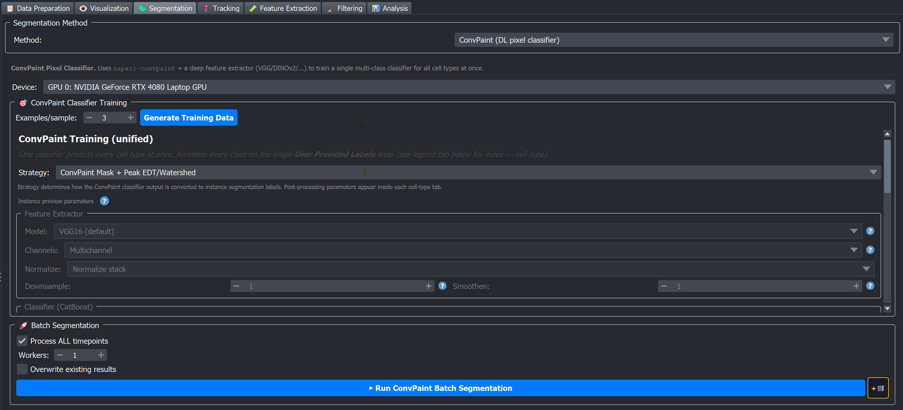

# 🎨 ConvPaint

ConvPaint is the **deep-features pixel classifier**. Instead of computing classical features (Gaussian / Sobel / Laplacian like [APOC](apoc) or [Pixel Classifier](pixel_classifier)), it runs your image through a pretrained CNN or transformer feature extractor (VGG16, DINOv2, …) and then fits a CatBoost gradient-boosted classifier on top of the extracted features. The result is a single multi-class pixel classifier that predicts *every* cell type at once.

```{important}
ConvPaint is **multi-class single-model**: one classifier maps each pixel to either background or *any* of the cell types. This is different from [APOC](apoc) and [Pixel Classifier](pixel_classifier), where you train one binary classifier per cell type. In practice you paint all classes onto a single Labels layer (the *legend tab* below the per-cell-type tabs assigns label index → cell type).
```

Pick it when:

- Your cells have **subtle textures or weak boundaries** that classical features struggle with.
- You have a **PyTorch-compatible device** — CUDA GPU is strongly recommended; the widget also exposes a CPU fallback but inference is much slower.
- You want a single model that handles all your cell types together.



## Strategies

ConvPaint's strategy combo controls how the predicted probability / mask becomes instance labels:

| Strategy | What it does |
|---|---|
| **ConvPaint Mask + EDT/Watershed** (default) | Threshold ConvPaint's predicted mask → Euclidean Distance Transform → watershed seeds above a threshold → watershed. |
| **ConvPaint Mask + Peak EDT/Watershed** | Same idea, but watershed seeds are placed at *peaks* of the EDT. Better for densely-packed objects with clear central peaks. |
| **ConvPaint Probability + Watershed** | Use the full probability map (not just the binary mask) for both seed placement and watershed. |
| **Advanced (per cell type)** | One strategy per cell type. |

## Step-by-step in the napari plugin

A full session usually goes like this:

1. **Open the Segmentation tab** → pick **ConvPaint (DL pixel classifier)** from the method dropdown.
2. **Pick a device** at the top (CUDA GPU strongly preferred).
3. **Pick a strategy.** Start with **ConvPaint Mask + EDT/Watershed** (default). Only switch to Peak EDT or Probability + Watershed if the initial result has the specific failure mode each one is designed for (densely-packed cells with clear central peaks; noisy mask boundary, respectively).
4. **Set `Examples / sample`** (default 3) and click **Generate Training Data**. The viewer clears and loads timepoints as Image layers plus **one** `User Provided Labels` layer (ConvPaint is multi-class — one Labels layer holds all classes).
5. **Open the `Legend` tab** (the first tab in the *Annotation & Segmentation* tab strip, before the per-cell-type tabs) to see which label index maps to which cell type (`1 = background`, `2 = organoid`, `3 = tcell`, etc.).
6. **Paint each class on the single Labels layer using its assigned index.** A few hundred pixels per class is usually enough; bias your strokes toward boundaries and confusing regions.
7. **Open the Feature Extractor group** and (usually) leave it on `VGG16` + `Multichannel` + `Normalize stack` + `Downsample 1`. Switch to DINOv2 / JAFAR DINOv2 only if VGG16's mask is "too smooth" or fails on subtle textures.
8. **(Optional) Open the Classifier group** if you want to tweak CatBoost (iterations, depth, learning rate, class weights). The defaults (100 / 5 / 0.1 / Balanced) work for most datasets.
9. **Click `▶ Train Classifier`.** This trains the single unified multi-class classifier from your painted `User Provided Labels` (and the separate binary death classifier if a dead channel is present). Training time on a GPU depends on the feature extractor and the number of painted pixels.
10. **Click `Run instance segmentation`** in the per-cell-type tab to inspect the result on the current timepoint. To re-apply only the post-processing after changing a watershed parameter (without recomputing features), use **`🔁 Re-run preview`** instead — it reuses the cached classifier output.
11. **Inspect the result.** Adjust feature-extractor settings, CatBoost parameters, or the per-cell-type watershed parameters as needed (see [Tuning the parameters](#tuning-the-parameters)). Re-train and re-preview.
12. **Scroll to section 7 (Batch segmentation)** → pick timepoint range → click **▶ Run ConvPaint Batch Segmentation** for an immediate run, or **+🛒** to queue.

```{warning}
Changing the **Feature Extractor model** (the `Model` dropdown) invalidates the trained classifier. You **must** retrain after switching backbones — the preview will simply error out otherwise.
```

### 1 · Device

The `Device` dropdown at the top lists `CPU`, `Auto (best available)`, and one entry per CUDA GPU the system can see. A CUDA GPU is strongly preferred for any non-trivial volume.

### 2 · Strategy + Training data

| Control | Default | Effect |
|---|---|---|
| **Strategy** | ConvPaint Mask + EDT/Watershed | One of the strategies listed above. |
| **Examples / sample** | 3 | Number of timepoints sampled per metadata row as training data (range 1–10). |
| **Generate Training Data** | — | Clears the viewer and loads the sampled timepoints + a single `User Provided Labels` layer (the multi-class label canvas). |

A legend tab inside the training widget maps each label index (1, 2, 3, …) to a cell type (background, organoid, tcell, …). Paint each class on the same Labels layer using its assigned index. The shared labeling guidance (where and how much to paint) applies here too — see [Labeling foreground and background](./index.md#labeling-foreground-and-background) (ConvPaint is the multi-class case described there).

### 3 · Feature Extractor (global, applies to all cell types)

This group controls how raw pixels are turned into per-pixel feature vectors *before* the classifier sees them.

| Control | Options | Default | Effect |
|---|---|---|---|
| **Model** | VGG16 (default), VGG16 Medium, VGG16 Large, DINOv2, JAFAR DINOv2, Gaussian, Cellpose, Ilastik | VGG16 | Pretrained network used to extract features. VGG16 is fast and lightweight; DINOv2 / JAFAR DINOv2 are transformer-based and often more expressive (slower). `Gaussian` falls back to a classical filter bank — useful for a quick non-DL baseline. |
| **Channels** | Single channel, Multichannel, RGB (3-ch color images) | Multichannel | How the input is fed to the extractor. `Multichannel` runs the extractor on each raw channel separately and concatenates the resulting features. `Single` averages the channels first. |
| **Normalize** | No normalization, Normalize stack, Normalize per plane | Normalize stack | Per-image intensity normalisation applied before feature extraction. |
| **Downsample** | -4 to 16 (integer) | 1 | Spatial downsampling factor before extraction. `1` = native resolution. Values > 1 make inference faster but coarser; negative values upsample. |
| **Smoothen** | 0 to 20 | 1 | Number of post-classification smoothing iterations applied to the predicted label map. Reduces single-pixel noise but can erode thin structures. |

```{warning}
Changing the Feature Extractor model **invalidates the trained classifier** — you must retrain after switching backbones.
```

### 4 · Classifier (CatBoost)

ConvPaint uses [CatBoost](https://catboost.ai), a gradient-boosted decision-tree classifier (not a Random Forest).

| Control | Range | Default | Effect |
|---|---|---|---|
| **Iterations** | 10–2000 | 100 | Number of boosting rounds (trees). More iterations = richer model, slower to train, more risk of overfit. |
| **Depth** | 1–16 | 5 | Maximum depth of each tree. 3–6 is a good starting range. |
| **Learning rate** | 0.001–1.0 | 0.1 | Shrinkage applied to each new tree's contribution. Lower values need more iterations but generalise better. |
| **Class weights** | None, Balanced (default), SqrtBalanced | Balanced | How to handle class imbalance when some classes have far fewer painted pixels. `Balanced` uses inverse-frequency weights; `SqrtBalanced` is a milder version. |

Below the classifier group are three global performance checkboxes (all **OFF** by default):

| Checkbox | Effect |
|---|---|
| **Tile annotations** | During *training*, only extract features inside annotated regions. Faster when annotations are sparse. |
| **Tile image** | During *prediction*, extract features in tiles. Reduces peak memory on large images. |
| **Use Dask** | Parallelises tiled prediction with Dask. Only takes effect when **Tile image** is also on. Beta feature — may not be fully optimised. |

### 5 · Per cell-type tab — Instance-preview parameters

Each cell-type tab includes an "Instance Segmentation Preview" group whose spinboxes (EDT threshold, mask / seed thresholds, opening, min size, fill holes, peak min-distance, peak min-ratio) depend on the chosen strategy. Their meaning and tuning are documented once in [Instance post-processing parameters](./index.md#instance-post-processing-parameters); the set shown per strategy and the defaults match APOC for the equivalent strategy.

### 6 · Train + Preview

- **▶ Train Classifier** fits the unified CatBoost classifier on the painted labels using features from the chosen extractor (plus the binary death classifier when a dead channel exists). Trained models are saved under `<output_dir>/images/PixelClassification/`.
- **Run instance segmentation** (per cell-type tab) runs the full pipeline (feature extractor → classifier → post-processing) on the currently displayed timepoint and adds the result to the viewer.
- **🔁 Re-run preview** re-applies the post-processing for the current tab using the cached classifier output, so you can iterate on watershed parameters without re-extracting features.

## Tuning the parameters

Use the per cell-type **Run instance segmentation** button between every change (or **🔁 Re-run preview** when you only changed a watershed parameter). There are three groups of parameters that can affect the result: **feature extractor**, **CatBoost classifier**, and **per cell-type post-processing**.

**Feature Extractor — `Model`**

- VGG16 (default) works for most datasets and is the fastest. Try it first.
- The mask is "too smooth" — classes that should be separable are bleeding into each other → switch to **DINOv2** or **JAFAR DINOv2** (more expressive, transformer-based features) and retrain.
- VRAM error during training or inference → switch to a smaller model (`VGG16` instead of `VGG16 Large`, or fall back to `Gaussian` for a quick non-DL baseline).

**Feature Extractor — `Channels`**

- `Multichannel` (default) preserves per-channel information and is almost always what you want.
- Use `Single channel` only when one channel alone is highly discriminative and others add noise.
- Use `RGB` only for true 3-channel colour images (rare in fluorescence microscopy).

**Feature Extractor — `Normalize`**

- `Normalize stack` (default) computes one global intensity normalisation per stack — usually right for fluorescent data with consistent staining.
- Switch to `Normalize per plane` if your samples have strong Z-direction intensity gradients (e.g. attenuation deep in the tissue).
- Use `No normalization` only when intensity values are already comparable across samples.

**Feature Extractor — `Downsample`**

- Inference is too slow or VRAM-bound → raise `Downsample` to 2 (4× less work in 2D, 8× less in 3D). Predictions are upsampled back at the end, so the practical quality cost is small for organoid-scale objects.
- Subtle textures matter for small cells (e.g. T cells) → keep `Downsample` at 1 or use a negative value (e.g. -2) to upsample first.

**Feature Extractor — `Smoothen`**

- Speckly mask with single-pixel noise → raise `Smoothen` (1 → 3 or 5).
- Thin structures are eroded → lower `Smoothen` to 0.

**CatBoost — `Iterations`**

- Default 100 is sensible. Raise to 200–500 if the classifier is clearly under-fitting *and* the painted set is small enough that training stays fast (a few minutes).
- Lower `Learning rate` if you raise iterations a lot, otherwise CatBoost overfits.

**CatBoost — `Depth`**

- Default 5 is a balanced starting point. Most production ConvPaint setups stay in the 3–6 range.
- Raise to 7–10 only for clearly under-fit textures with lots of painted pixels.

**CatBoost — `Learning rate`**

- Default 0.1 is fine. If you increase `Iterations` substantially (e.g. 100 → 500) you should also lower `Learning rate` (e.g. 0.1 → 0.03) — that's the classic CatBoost / gradient-boosting trade-off for better generalisation.

**CatBoost — `Class weights`**

- `Balanced` (default) handles cell-type imbalance reasonably well.
- If one class dominates (e.g. background is 95 % of painted pixels) and other classes are being under-predicted, `Balanced` is the right choice.
- `None` is rarely the right answer unless your label counts are roughly equal across classes.
- `SqrtBalanced` is the conservative middle ground when `Balanced` overcorrects (e.g. random "rare" pixels appear everywhere).

**Per cell-type post-processing**

The EDT / mask / seed thresholds and opening / min-size spinboxes follow the shared rules — see [Tuning (failure mode → fix)](./index.md#instance-post-processing-tuning) for what to change when something looks wrong, and [Advice: large vs small objects](./index.md#advice-large-vs-small-objects) for large vs small starting points.

### 7 · Batch segmentation

Standard batch controls — see [Batch segmentation controls](./index.md#batch-segmentation-controls). The run/queue buttons here are **▶ Run ConvPaint Batch Segmentation** and **+🛒**.

## Outputs

| File | Path |
|---|---|
| Per-cell-type instance labels | `<output_dir>/images/<sample>/<sample>_<cell_type>_segments.zarr` |
| Trained ConvPaint model bundle | `<output_dir>/images/PixelClassification/` — treat the directory contents as opaque artefacts. |

## Good practices & tips

- **Start with VGG16.** It is the default and runs fastest on commodity GPUs. Only switch to DINOv2 / JAFAR DINOv2 if VGG16's probability map is "too smooth" or fails on subtle textures — these heavier extractors are slower and need more VRAM.
- **CatBoost defaults are sensible.** 100 iterations, depth 5, learning rate 0.1 is a balanced starting point. If you see overfitting (great on the labelled frame, poor elsewhere), lower the learning rate to ~0.03 and proportionally raise iterations.
- **Class weights = Balanced is the safe default.** If one cell type has far fewer pixels than the others, leaving class weights at None will give you a classifier that systematically under-predicts that class. `SqrtBalanced` is the conservative middle ground.
- **Downsample > 1 if VRAM is tight.** Inference time scales with the number of feature vectors; a downsample of 2 cuts the work by 4× in 2D, 8× in 3D. The predictions are upsampled back at the end.
- **Switching feature extractors invalidates the model.** Retrain after any change to the Model dropdown.

## Things this page does **not** claim

- That DINOv2 always beats VGG16 (or vice versa) — this is dataset-dependent. The help-text in the widget itself describes DINOv2 as "stronger feature representations… slower but often more accurate", which matches typical published results, but BEHAV3D EXPLORER ships no benchmark validating this on organoid / immune-cell data.
- Specific per-timepoint inference numbers — these depend strongly on GPU, volume size, backbone, and downsample. Profile your own data.

## See also

- [napari-convpaint documentation](https://github.com/guiwitz/napari-convpaint) — upstream project, including details on the feature extractors and CatBoost integration.
- [APOC](apoc) — classical-features alternative when speed and GPU memory matter more than feature richness.
- [Pixel Classifier](pixel_classifier) — CPU-only baseline.
- [Processing Queue](../../plugin_essentials/processing_queue) for batching training and segmentation steps.
