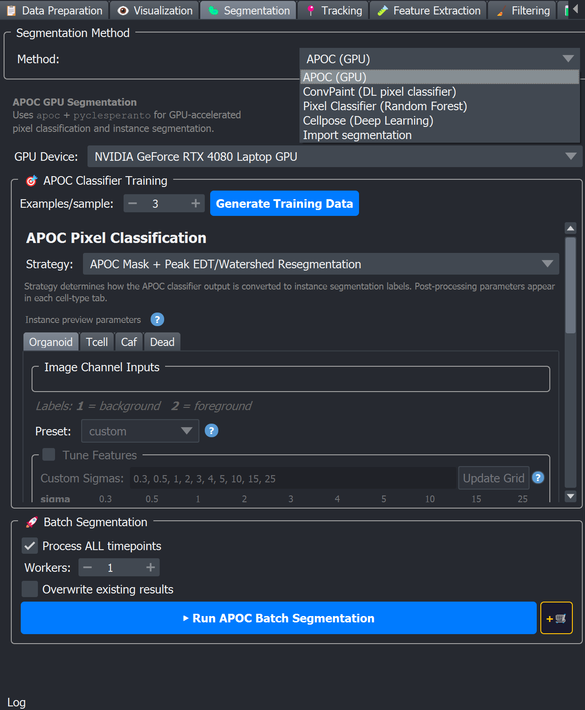

# 🦠 Segmentation

Tab 3 of the BEHAV3D EXPLORER dock widget. Segmentation turns each timepoint of the raw zarr into **instance labels**, one integer label per cell, written to:

```
<output_dir>/images/<sample>/<sample>_<cell_type>_segments.zarr
```

The zarr is a 4-D `(T, Z, Y, X)` `uint16` array; pixel value `0` is background; positive integers are individual cell IDs *within a timepoint* (track IDs are assigned later by the [Tracking](../tracking/index)).



## The five methods

A top dropdown lets you pick the segmentation method. The body of the tab swaps to show that method's parameters.

| Method (dropdown label) | What it is | Hardware |
|---|---|---|
| **APOC (GPU)** | GPU pixel classifier — random forest trained on classical image features (Gaussian, edges, Laplacian, …) | OpenCL GPU |
| **ConvPaint (DL pixel classifier)** | Pixel classifier where features come from a pretrained deep network (VGG / DINOv2 / …) and a gradient-boosted classifier predicts every class at once | PyTorch (CUDA GPU recommended; CPU possible) |
| **Pixel Classifier (Random Forest)** | CPU equivalent of APOC — same family of classifier, classical features computed on the CPU | CPU |
| **Cellpose (Deep Learning)** | Pretrained deep-learning instance segmenter — outputs cell-level masks directly | PyTorch (CUDA GPU strongly recommended) |
| **Import segmentation** | Validates and copies segmentations produced outside BEHAV3D EXPLORER into the canonical layout | n/a |

## How to pick a method

Method choice depends mostly on **what your objects look like**, **whether you have a GPU**, and **whether someone has already trained a model for your sample type**:

```{mermaid}
flowchart TD
    A["Your situation?"] --> D["Already segmented elsewhere<br/>(Imaris, Ilastik, script, …)"]
    D --> J["Import segmentation"]

    A --> B["Roundish, well-separated<br/>(organoids, T cells, …)"]
    A --> C["Subtle texture or weak boundaries"]
    A --> E["Other shapes<br/>(elongated, irregular, clustered, …)"]

    B --> F{"Pretrained Cellpose<br/>model fits?"}
    F -- "Yes" --> Cellpose["Cellpose<br/>(no pixel labeling)"]
    F -- "No" --> L

    C --> L
    E --> L

    L{"Can you paint a few<br/>foreground/background pixels?"}
    L -- "Yes" --> PC["Train a pixel classifier<br/>(all need painted labels):<br/>APOC · ConvPaint · Pixel Classifier<br/>— pick by GPU; ConvPaint often best<br/>for subtle texture"]
    L -- "No" --> N["Import existing masks, or<br/>Cellpose training notebook"]
```

```{note}
**Cellpose** appears only on the *roundish, well-separated* branch because the lab's pretrained models target roughly convex cells.
```

Practical rules:


- **APOC** is the right pixel classifier when you have a GPU with working OpenCL drivers and you can paint a few foreground/background pixels per cell type (same labeling step as Pixel Classifier; ConvPaint paints all classes on one layer instead — see [Labeling foreground and background](#labeling-foreground-and-background)). Training is quick; inference is fast on a modern GPU.
- **ConvPaint** uses pretrained deep features (VGG-16 or DINOv2), useful when APOC's classical filter bank cannot separate cells with subtle intensity differences, ambiguous boundaries, or texture-based contrast. Requires a PyTorch-compatible device (CUDA GPU strongly preferred; the widget exposes a CPU fallback).
- **Pixel Classifier (Random Forest)** is the CPU-only fallback, same family of classifier as APOC, but features are computed with `scikit-image` instead of `pyclesperanto`. Use it when no GPU is available.
- **Cellpose** is the *only* method that performs **true instance segmentation in one shot**, it directly outputs separated cell labels for roughly-spherical / convex cells. The other three methods are *pixel classifiers* (foreground vs. background / per-class probability), and BEHAV3D EXPLORER turns their output into instance labels by post-processing (watershed). When the lab already has a pretrained Cellpose model for your sample type (see [Cellpose page](cellpose) and [Zenodo](https://zenodo.org/records/18872978), check description to decide if fits your data).
- **Import segmentation** is *not* a way to create segmentations, it validates existing masks (.tiff/ .tif) into BEHAV3D EXPLORER's canonical zarr layout so the rest of the pipeline can consume them.

## Common structure of every method page

The four trainable methods all follow the same three-section UI inside the BEHAV3D EXPLORER dock widget:

1. **Training / configuration** — pick a strategy, generate training data (loads a few timepoints into the napari viewer with empty Labels layers to paint into), train the classifier.
2. **Preview / fine-tune** — run the trained model on the currently displayed timepoint to check quality before committing to a batch run.
3. **Batch segmentation** — process either all timepoints or a custom range across every sample in the metadata. See [Batch segmentation controls](#batch-segmentation-controls) below.

The per-method pages below document the exact widgets, parameters, and tips for each one. The labeling step, the post-processing parameters, and the batch controls are shared across the pixel-classifier methods and are described once in the three sections below.

(labeling-foreground-and-background)=
## Labeling foreground and background

The three pixel-classifier methods (APOC, Pixel Classifier, ConvPaint) are trained by painting a few labels into the napari viewer on the Labels layer(s) created by **Generate Training Data**. How the labels are organised differs:

- **APOC and Pixel Classifier are binary, one Labels layer per cell type.** You paint two classes with these brush values (the legend is shown in the widget):

| Brush value | Meaning | Colour in legend |
|---|---|---|
| `0` | Eraser | — |
| `1` | Background | red |
| `2` | Foreground (the cell type you are training) | cyan |

- **ConvPaint is multi-class on a single layer.** All classes are painted on one `User Provided Labels` layer using the index shown in its **Legend** tab (`1` = background, `2` = first cell type, `3` = next, …).

**Labeling tips (apply to all three methods):**

- You only need **enough pixels to disambiguate the classes** — typically dozens to a few hundred per class per timepoint. You do *not* need to paint whole cells.
- **Bias your strokes toward boundaries** and any visually-confusing region (touching cells, low-contrast areas) — that is where pixel classifiers fail most.
- Label examples from **different timepoints and Z-slices** (e.g. start / middle / end and a few Z levels) so the classifier sees the variability in your data.
- **Balance examples across all classes** — don't only label the easiest cells.
- **Avoid contradictory labels**; only label regions you are confident about.
- **Save your labels often** (the *Save Labels* / *Save User Labels* button) — unsaved labels are lost when the viewer closes.

(instance-post-processing-parameters)=
## Instance post-processing parameters

APOC, ConvPaint and the Pixel Classifier are *pixel* classifiers: their raw output is a foreground/background mask or a per-class probability map. BEHAV3D EXPLORER turns that into **instance labels** with a watershed-based post-processing pipeline. The same parameters appear (with method-specific defaults) wherever a watershed strategy is selected; their meaning is identical everywhere:

| Parameter | Meaning |
|---|---|
| **EDT threshold** | Threshold on the Euclidean Distance Transform of the mask. Voxels above it become watershed seeds. **Lower → more aggressive splitting** of touching objects; **higher → objects stay merged**. `0` disables splitting. |
| **Opening px** | Morphological opening applied to the mask before watershed. Smooths boundaries and removes small protrusions / speckles. `0` disables. |
| **Min size** | Segments smaller than this many voxels are discarded after watershed (noise / debris filter). |
| **Fill holes** | Fill internal gaps inside objects before watershed (recommended for solid 3-D objects). |
| **Mask threshold** *(probability strategies)* | Foreground cutoff applied to the probability map. |
| **Seed threshold** *(probability strategies)* | Higher cutoff used to place watershed seeds; should be ≥ Mask threshold. Lower → more seeds (more splitting). |
| **Peak min dist** *(peak-EDT strategies)* | Minimum distance (µm) between local EDT peaks used as seeds. Larger → fewer, more separated seeds. |
| **Peak min ratio** *(peak-EDT strategies)* | Minimum EDT peak height as a fraction of the local maximum (0–1). Higher → fewer seeds. |

(instance-post-processing-tuning)=
#### Tuning (failure mode → fix)

- Touching cells **merged** into one label → **lower EDT** (or, for probability strategies, **raise Seed threshold**).
- One cell **split** into several labels → **raise EDT** (or **lower Seed threshold**).
- Background labelled as cells → **raise Mask threshold**, or add more background labels.
- Cells lost at the edges → **lower Mask threshold**.
- Small speckles appear as tiny labels → **raise Min size**; real small cells dropped → **lower Min size**.
- Fuzzy / jagged boundaries or single stray voxels → **raise Opening**; thin structures eroded → **lower Opening** (or `0`).

(advice-large-vs-small-objects)=
### Advice: large vs small objects

For **APOC**, **ConvPaint**, and the **Pixel Classifier**: tune **each cell type on its own tab**. Settings for **big** objects (e.g. organoids) are usually wrong for **small, crowded** ones (e.g. immune cells / T cells).

- Work **one cell type at a time**: train (or paint), run a **preview**, look at the labels, adjust sliders, repeat. Settings on one tab do not apply to another.
- **Big** (e.g. organoids): **large** minimum size; EDT around **10–12** so one object is not cut in pieces. Stuck together → **lower** EDT. Fuzzy outline → try a **probability-map** strategy if your method has one.
- **Small / crowded** (e.g. immune, T cells): **small** minimum size; **lower** EDT to start. One cell split into many → **raise** EDT. Very packed → **peak-EDT** strategies often help.
- **Ballpark numbers:** see organoid vs immune defaults on the [Pixel Classifier](pixel_classifier) page (EDT **12** / min **1000** vs EDT **2.5** / min **10**); copy similar values in APOC or ConvPaint, then adjust by eye.
- **Several cell types in one experiment?** In APOC or ConvPaint, **Advanced (per cell type)** lets each type use a different strategy; still tune post-processing separately on each tab.

```{note}
Which sliders you see depends on the strategy you pick. Default numbers differ by method — see each method page. The [Pixel Classifier](pixel_classifier) fills in big-vs-small starting values from your metadata; on APOC and ConvPaint you enter similar numbers yourself. Always adjust for the **nature of your data** (big vs small, crowded vs sparse, sharp vs fuzzy boundaries).
```

(batch-segmentation-controls)=
## Batch segmentation controls

The pixel-classifier methods (APOC, ConvPaint, Pixel Classifier) share the same batch-run controls:

| Control | Default | Effect |
|---|---|---|
| **Process ALL timepoints** | ON | Segment the full movie of every sample. Uncheck to enable the From–To range. |
| **From t / to t** (range) | — | Inclusive timepoint range, active only when *Process ALL* is off. |
| **Workers** | 1 | Parallel CPU workers for zarr I/O, capped at one less than your CPU core count. For the GPU methods (APOC/ConvPaint) the GPU is the actual segmenter, so 1–2 is usually optimal. |
| **Overwrite existing results** | OFF | Re-segment samples that already have an output zarr. Otherwise they are skipped. |
| **▶ Run …** | — | Runs immediately and blocks the GUI until done. |
| **+🛒** | — | Queues the step in the [Processing Queue](../../plugin_essentials/processing_queue) to run later, sequentially with the rest of the pipeline. |

```{note}
Cellpose has its own Run / **+🛒** controls in its Section 3, and Import uses Convert buttons instead — see their pages.
```

## Outputs

Every method writes its instance labels to the same canonical path:

```
<output_dir>/images/<sample>/<sample>_<cell_type>_segments.zarr
```

Trained pixel-classifier models (APOC, ConvPaint, Pixel Classifier) are written under `<output_dir>/images/PixelClassification/`. Cellpose models are *not* stored under the output directory, they are loaded from wherever you point the Browse field.

See the [Output Directory & File Layout](../../plugin_essentials/output_layout) page for the full canonical layout.

```{toctree}
:hidden:
:maxdepth: 1

apoc
convpaint
pixel_classifier
cellpose
import
```
