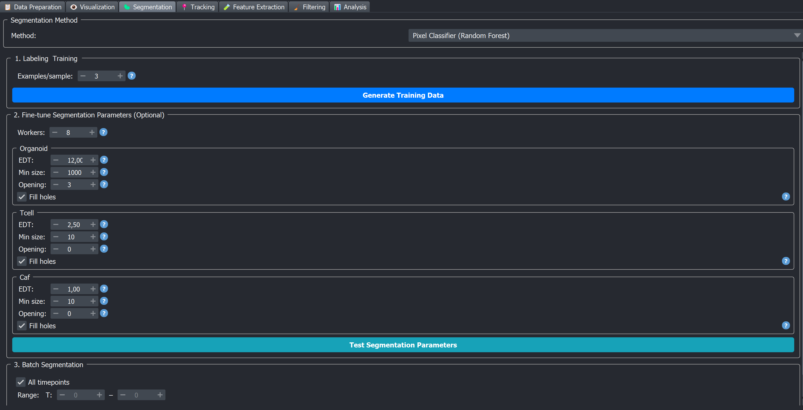

# 🧪 Pixel Classifier

The Pixel Classifier is the **CPU-only** pixel classification method bundled with BEHAV3D EXPLORER. For each cell type, you paint a few background / foreground pixels in the napari viewer, the plugin computes multiscale image features at those pixels, fits a Random Forest classifier, and uses it to label every voxel as foreground or background. The binary mask is then turned into instance labels by a post-processing pipeline (fill holes → opening → distance-transform watershed → size filter).

```{important}
The Pixel Classifier is **binary per cell type**: foreground vs. background. If you have N cell types, you train N separate classifiers, one per cell type. Multi-class single-model training is the job of [ConvPaint](convpaint).
```

The Pixel Classifier runs entirely on the CPU. For method choice across all six segmentation options, see the [segmentation overview](./index.md#how-to-pick-a-method).



## What runs under the hood

For each cell type the plugin:

1. Builds a feature stack from the chosen raw channels — Gaussian-smoothed intensity plus Sobel-edge magnitude, computed at four fixed spatial scales `[0.89, 1.77, 3.54, 14.16] µm`. The pixel-size scaling is read from your metadata so the same sigma list works regardless of acquisition resolution.
2. Fits a binary Random Forest (50 trees, max depth 20) on the pixels you have painted as foreground vs. background. The number of trees and max depth are **not exposed in the GUI** — they are fixed for stability.
3. Predicts a foreground mask, post-processes it (fill holes → morphological opening → Euclidean Distance Transform → watershed → size filter), and writes the resulting instance labels to disk.

## Step-by-step in the napari plugin

The widget is organised in three numbered group-boxes. A full session usually goes like this:

1. **Open the Segmentation tab** → pick **Pixel Classifier (Random Forest)** from the method dropdown.
2. **Set `Examples / sample`** (default 3 is usually fine).
3. **Click `Generate Training Data`.** The viewer clears and loads a handful of random timepoints per sample as Image layers plus one empty Labels layer per cell type (named `User Provided Labels …`).
4. **Paint a few foreground (`2`) and background (`1`) pixels** on the Labels layer of the cell type you want to train. See [Labeling foreground and background](./index.md#labeling-foreground-and-background) for the painting convention and tips (where and how much to paint) shared by all pixel-classifier methods.
5. **Click `Save Labels`** to persist your work to disk (do this often).
6. **Click `Train Classifier`.** Training takes a few seconds. A small bar chart of feature importances is displayed.
7. **Scroll to section 2 (Fine-tune Segmentation Parameters)** → for each cell type, check `EDT`, `Min size`, `Opening`, `Fill holes`. Defaults are tuned per category (organoid / immune / other) and usually only need small adjustments — see also [Advice: large vs small objects](./index.md#advice-large-vs-small-objects) on the [segmentation overview](./index.md).
8. **Click `Test Segmentation Parameters`** to preview the result on the currently displayed timepoint. A new Labels layer appears in the viewer — toggle it on/off to compare with the raw image.
9. **Inspect the result.** If cells are merged together, split apart, or contain noise, see [Tuning the parameters](#tuning-the-parameters) below. Adjust → re-test → repeat.
10. **Scroll to section 3 (Batch Segmentation)** → pick the timepoint range → click **▶ Run Batch Segmentation** to run now, or **+🛒** to queue the segmentation step in the [Processing Queue](../../plugin_essentials/processing_queue) and launch later together with other steps.

```{tip}
Iteration is cheap: re-training takes seconds and `Test Segmentation Parameters` previews a single timepoint instantly. A typical first pass is *paint → train → test → paint more on the worst-looking regions → retrain*.
```

### 1 · Labeling & Training

| Control | Default | Effect |
|---|---|---|
| **Examples / sample** | 3 | Number of timepoints loaded per sample as training data (range 1–10). More timepoints = more variability for the classifier to learn from, at the cost of a longer labeling session. |
| **Generate Training Data** | — | Clears the viewer and loads `examples_per_sample × N_samples` timepoints as Image layers, plus an empty "User Provided Labels …" Labels layer per cell type. |
| **Save Labels** | — | Persists every "User Provided Labels …" layer to disk as zarr, so they survive plugin restarts. Stored under `<output_dir>/images/PixelClassification/`. |
| **Clear Layer / Clear All** | — | Erase painted labels in the currently-selected layer / all layers. |
| **Train Classifier** | — | Fits one Random Forest per cell type. Models are saved as `<output_dir>/images/PixelClassification/PixelClassifier_<CellType>.joblib`. When a dead channel is present, an extra `PixelClassifier_Death.joblib` is trained from the dead-channel labels. |

The painting convention (`0` = eraser, `1` = background, `2` = foreground) and labeling tips are shared across methods — see [Labeling foreground and background](./index.md#labeling-foreground-and-background). A matching colour legend is shown above the buttons.

### 2 · Fine-tune Segmentation Parameters (Optional) — per cell type

This section appears once metadata is loaded. One group-box per cell type is generated, with category-dependent defaults:

| Parameter | What it does | Default for organoids | Default for immune cells | Default for "other" |
|---|---|---|---|---|
| **EDT** | Erosion-style threshold on the Euclidean Distance Transform of the binary mask. Voxels with EDT above the threshold become *watershed seeds*. **Higher → more aggressive splitting** of touching objects (the threshold erodes further, breaking the thin neck between them); **lower → objects stay merged**. `0.0` disables splitting (not recommended). | 12.0 | 2.5 | 1.0 |
| **Min size** | Minimum object volume in voxels. Anything smaller is discarded as noise. | 1000 | 10 | 10 |
| **Opening** | Radius of morphological opening (in pixels) applied to the binary mask before watershed. Smooths boundaries and removes small protrusions. `0` disables. | 3 | 0 | 0 |
| **Fill holes** | If checked, internal holes in the foreground mask are filled before watershed. | ON | ON | ON |

The **Workers** spinbox (above the per-cell-type group-boxes) controls how many CPU processes are spawned for batch inference. It is capped at one less than your CPU core count.

A **Test Segmentation Parameters** button at the bottom of this section runs the current parameters on the currently displayed timepoint and adds the result as a temporary Labels layer — useful for iterating on EDT / opening / fill-holes without committing to a batch run.

### 3 · Batch Segmentation

Standard batch run — see [Batch segmentation controls](./index.md#batch-segmentation-controls) for the shared behaviour. This method's controls differ slightly in wording/placement:

- The checkbox is labelled **All timepoints**, and the range is shown as **T: start – end** (active when it is off).
- The run button is **Run Batch Segmentation** and queues with **+🛒**.
- **Workers** lives in Section 2 (not here), and there is no overwrite checkbox — existing results trigger a confirmation prompt instead.

There is also a **+🛒** button next to **Train Classifier** that queues a training step — useful when you want to retrain later as part of a batch run (e.g. after adding more labels offline).

## Tuning the parameters

Use `Test Segmentation Parameters` between every change. The rules below are the ones that actually matter on real data.

**Post-processing parameters (EDT / Min size / Opening / Fill holes)**

- For this method EDT is the most important parameter — **raise it to split touching cells more aggressively, lower it to keep them merged**. The full failure-mode → fix heuristics for all four parameters are shared and documented once in [Tuning (failure mode → fix)](./index.md#instance-post-processing-tuning) on the [segmentation overview](./index.md).

**Examples / sample**

- Result looks good on the timepoints you trained on but poor on others → the classifier hasn't seen enough variability. Click `Generate Training Data` again with a higher value (e.g. 5–8), paint a few more representative pixels, and retrain.

**If the classifier itself is the problem (not post-processing)**

The Random Forest is fine-tuned on the painted pixels only. If the *raw foreground mask* is wrong (before any EDT / opening), no amount of post-processing will save it.

- Foreground bleeds into background → add more **background labels**, especially near misclassified regions.
- Cells are not detected at all → add more **foreground labels**, especially at the missed cells' boundaries.
- Behaviour is fine on bright cells but fails on dim ones → either include some dim cells in your labels (best fix), or consider switching to [APOC](apoc) or [ConvPaint](convpaint), which compute richer features.

## Outputs

| File | Path |
|---|---|
| Per-cell-type instance labels | `<output_dir>/images/<sample>/<sample>_<cell_type>_segments.zarr` |
| Trained classifiers | `<output_dir>/images/PixelClassification/PixelClassifier_<CellType>.joblib` |
| Trained dead classifier (if dead channel present) | `<output_dir>/images/PixelClassification/PixelClassifier_Death.joblib` |
| Saved user labels (Save Labels) | `<output_dir>/images/PixelClassification/User Provided Labels …` zarrs |

## Good practices & tips

- **Always click *Test Segmentation Parameters* on at least one timepoint before launching a batch run.** The EDT threshold and minimum size have a huge effect on the result and are much faster to iterate per-timepoint than per-batch.
- **Annotate boundary pixels.** This is where misclassifications hurt downstream segmentation the most — the watershed is seeded from the EDT inside the foreground, so noisy boundaries propagate into the instance labels.
- **Workers.** The Pixel Classifier is purely CPU. More workers ≈ faster batch inference, up to the cap of "one less than your CPU core count" that the widget enforces. The actual wall time per timepoint depends on volume size and channel count.
- **Save labels often.** The "Save Labels" button writes painted annotations to disk. If you don't save and you close the plugin, your labels are lost.
- **Re-training is cheap.** Training takes seconds (only the labelled pixels are used, not the whole image), so iterate liberally: add a few more labels → retrain → preview → repeat.

## See also

- [APOC](apoc) — same family of classifier, GPU-accelerated.
- [ConvPaint](convpaint) — alternative using deep features instead of classical ones.
- [Processing Queue](../../plugin_essentials/processing_queue) — queue training and segmentation to run sequentially.
