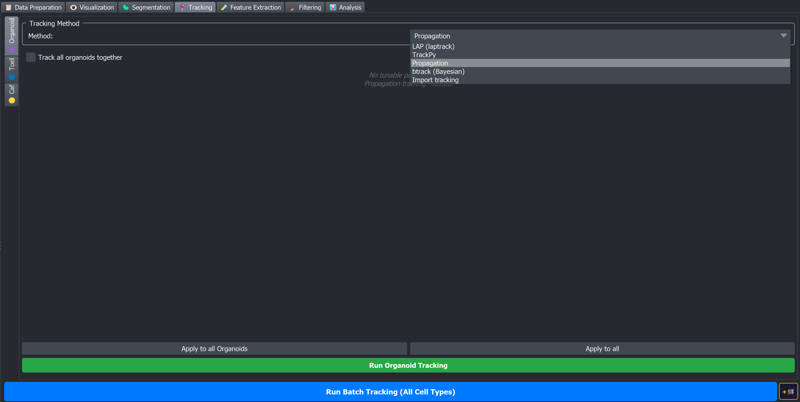

# 📍 Tracking

Tab 4 of the BEHAV3D EXPLORER dock widget. Tracking turns per-timepoint segmentation labels into **trajectories** — each physical cell keeps the same integer ID across time — and writes two artefacts per (sample, cell type):

```
<output_dir>/images/<sample>/<sample>_<cell_type>_tracked.zarr
<output_dir>/trackdata/<sample>/<cell_type>/<sample>_<cell_type>_tracks.csv
```

The tracked zarr is a 4-D `uint16` `(T, Z, Y, X)` array in which the pixel value is the **TrackID** (stable across timepoints). The CSV is one row per `(TrackID, timepoint)` with both physical-unit and pixel coordinates.



## Per-cell-type sub-tabs

Unlike the Segmentation tab, the Tracking tab is organised as **sub-tabs per cell type**. Each cell type declared in the metadata gets its own sub-tab where you pick a tracking method and its parameters independently — because what works for objects that overlap themselves between frames is rarely what works for objects that do not.

The sub-tabs use a colour code:

| Icon | Category | Examples |
|---|---|---|
| 🟣 | Organoid | `or_organoid`, `or_organoidA`, … |
| 🔵 | Immune | `im_tcell`, `im_macrophage`, … |
| 🟡 | Other | `ot_anythingelse` |

Special cases:

- **Multicolor cell types** (e.g. `tcell_1_multicolor`, `tcell_2_multicolor`) get a single combined panel that tracks each channel separately and then merges them into `{base}_merged`.
- **Track all organoids together**: by **default** all organoid cell types are collapsed into a single combined **🟣 All Organoids** sub-tab (fragmentation propagation only), with the "Track all organoids together" checkbox enabled — useful when you have multiple organoid types in the same well but want one unified track set where each voxel is occupied by only 1 organoid type_. Unticking the checkbox rebuilds one independent sub-tab per organoid type.

## The tracking methods

Each cell type is tracked with one of the following methods, picked from the method
dropdown in its sub-tab. Methods fall into two families — **centroid-based** (link by
how far a detection moved) and **overlap-based / propagation** (link by how much a
detection overlaps its previous position).

### Centroid-based tracking methods

Link detections frame-to-frame by comparing centroid positions, not overlap. Use one of
these when an object moves enough between frames that it may no longer overlap itself —
roughly one cell diameter or more.

| Method | What it does |
|---|---|
| **btrack (Bayesian)** | Bayesian tracker with a Kalman-filter motion model, optionally followed by a global hypothesis optimiser. The routine choice for objects that lose overlap between frames. See [btrack](btrack). |
| **LapTrack** | Linear Assignment Problem tracking: links detections by solving a global optimization on the centroid-distance cost matrix, with gap closing and optional merge/split events. An alternative to btrack when you specifically need globally-optimal linking or built-in division/fusion modelling. See [LapTrack](lap). |
| **TrackPy** | Crocker-Grier style nearest-neighbour linker with adaptive search radius and memory-based gap recovery. The lightest-weight option — only reliable when cells are well-separated relative to how far they move per frame. See [TrackPy](trackpy). |

### Overlap-based tracking methods (propagation)

Propagate the previous timepoint's labels onto the current timepoint's mask by spatial
overlap (watershed-based), not centroid distance. Use one of these when an object stays
largely in place so consecutive frames still overlap — typical for organoids and other
near-static structures.

| Method | What it does |
|---|---|
| **Fragmentation Propagation** | Propagates labels by overlap; no tunable parameters. The default propagation method — use it when objects mainly change by **fragmenting** (e.g. a structure breaking up on death, such as organoids) and the set of objects is closed, i.e. nothing new appears mid-movie. See [Fragmentation Propagation](fragmentation_tracking). |
| **Bounded Propagation** | Same overlap-based propagation, but with a topology rule that stops one track ID from spanning disconnected regions. Use it instead of Fragmentation Propagation when masks can **touch or join** but should stick to single connected regions and new objects can appear throughout the movie. See [Bounded Propagation](bounded_propagation). |
| **Reporter Propagation** | Pools segments across the whole movie, groups spatially-overlapping ones regardless of time, and stamps each group's single largest detection onto every timepoint. Use it for near-static objects whose segmentation **flickers on and off** (e.g. an intermittent reporter signal). See [Reporter Propagation](reporter_propagation). |

### Import tracking

| Method | What it does |
|---|---|
| **Import tracking** | Validates and re-chunks an externally-produced tracked zarr / TIFF into BEHAV3D EXPLORER's canonical layout. See [Import tracking](import). |


```{note}
**Pick the family from what you measure, not from the cell type.** Between two
consecutive frames, does an object still overlap where it was?

- **Large overlap** → an overlap-based/propagation method (second table above).
- **Little or no overlap** (the object moves about one cell diameter or more between
  frames) → a centroid-based method (first table above), normally **btrack**.

Whether a given population falls on one side or the other depends on your **frame
interval**, not on what the cells are: the same cell is "slow" at a short interval and
"fast" at a long one. Check the overlap in the Visualization tab before committing, and
verify every method visually on at least one sample before a batch run.
```

## Generic workflow per sub-tab

1. **Method dropdown** — pick the method.
2. **Method-specific parameter panel** appears below (fragmentation propagation has no tunable parameters, btrack has a two-part layout — Kalman-filter tracking + global optimisation, Import has a per-sample status table).
3. **Apply to all *Category* / Apply to all** — two buttons that propagate the current sub-tab's settings to other sub-tabs (same category, or all cell types).
4. **Run *Cell type* Tracking** — the green button at the bottom of the sub-tab (e.g. *Run Tcell Tracking*). It runs the selected method for **every sample** in the metadata for this one cell type, immediately, and blocks the GUI until it finishes.

When it finishes you are asked whether to switch to the Visualization tab to inspect the tracks.

```{tip}
**How to confirm tracking worked.** In the Visualization tab, look at the tracked-segments layer over time: **untracked** segments get a new colour/ID every timepoint, whereas **correctly tracked** segments keep the **same colour/ID across frames**. Hover over a label and check that its ID stays constant as you scrub through time.
```

### Tab-level controls (below the sub-tabs)

Two controls sit underneath the sub-tab area and act on **all** cell types at once:

- **Run Batch Tracking (All Cell Types)** — the blue button. Runs each cell type's currently-configured method in sequence, using whatever each sub-tab's parameters are set to.
- **+🛒** — adds a single tracking step to the [Processing Queue](../../plugin_essentials/processing_queue). The queued step is **global**: it batches every cell type's currently-configured tracking method at run time (it is not per-method).

If tracked outputs already exist, both the per-cell-type and batch runs ask whether to **Overwrite**, **Skip** existing data, or **Cancel**.

Settings are persisted to `behav3d_parameters.yml` so they survive plugin restarts.

## CSV column reference

Every tracking method writes a CSV with the same schema:

| Column | Type | Description |
|---|---|---|
| `TrackID` | int | Stable track identifier across timepoints (1-indexed; backgrounds are not represented). |
| `SegmentID` | int | The per-timepoint segment label this row corresponds to (changes from frame to frame even for the same TrackID). |
| `position_t` | int | 0-based timepoint index. |
| `position_x`, `position_y`, `position_z` | float | Centroid coordinates in **physical units** (computed as `centroid_pixel × pixel_distance_xy/z` from the metadata). |
| `pixel_position_x`, `pixel_position_y`, `pixel_position_z` | float | Centroid coordinates in **pixel units**. |

```{note}
The tracks CSV stores each cell’s position twice: in **pixels** (`pixel_position_*`) and in **physical units** (`position_*`, usually µm, from `pixel_distance_xy/z` in your metadata). Distance limits in the Tracking tab (e.g. btrack max search radius) are labeled “(px)” but are compared to the **physical** `position_*` values — enter them in those same units (typically µm), not as a pixel count.
```

## Outputs

| File | Path |
|---|---|
| Tracked labels image | `<output_dir>/images/<sample>/<sample>_<cell_type>_tracked.zarr` |
| Tracks table | `<output_dir>/trackdata/<sample>/<cell_type>/<sample>_<cell_type>_tracks.csv` |

When *Track all organoids together* is enabled, an extra combined set of outputs is written under the cell-type name `all_organoids` (`<sample>_all_organoids_tracked.zarr` and `.../all_organoids/<sample>_all_organoids_tracks.csv`), alongside the per-organoid-type files.

## After tracking

Once tracking has finished, two common next steps:

### Manual editing of tracked segments

After automated segmentation and tracking, you will often still have small mistakes — split labels, wrong merges, missed cells, junk objects. You fix these in a **separate workflow** that operates on **tracked** data (`*_tracked.zarr` and the tracks CSV), not on the raw segmentation (`*_segments.zarr`). **Run tracking first**, then correct.

You open the editor from the **[Visualization](../../plugin_essentials/visualization) tab**: load a sample, pick the cell type, click **✏️ Edit tracked segments**. There you can split, merge, delete, create, erode, or dilate labels, with undo/redo and save back to disk.

Full step-by-step instructions, all six tools, and tips: **[Manual editing of tracked segments](manual_editing)**.

### Feature extraction

- **[Feature Extraction](../../analysis/feature_extraction)** consumes the tracks CSV and tracked zarr to produce per-timepoint and per-track features.

```{toctree}
:hidden:
:maxdepth: 1

lap
trackpy
fragmentation_tracking
bounded_propagation
reporter_propagation
btrack
import
manual_editing
```
